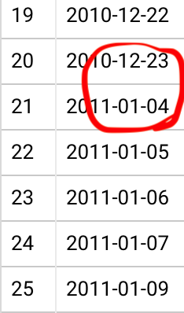
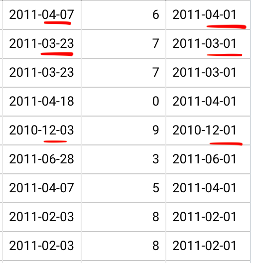
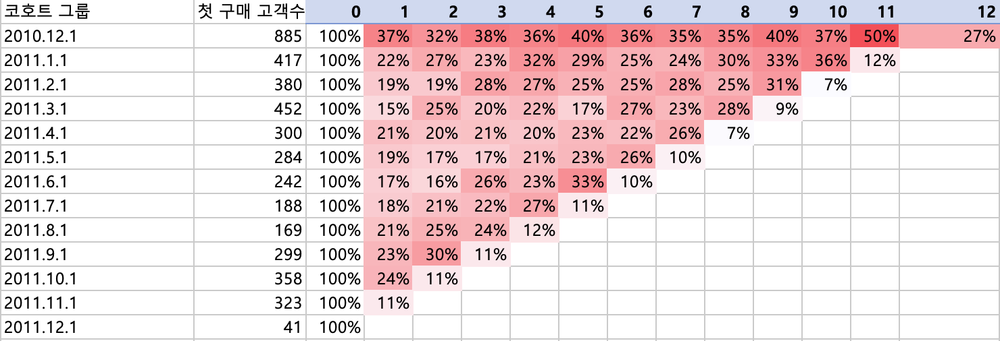
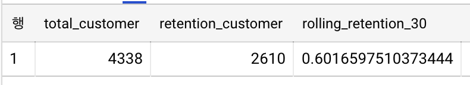

- 프로젝트: Cohort, Retention, RFM 을 통해 Retail 데이터 분석<br>
- 분석 목표:퍼널 분석을 통해 유입된 고객이 있다고 가정을 하고,Cohort 분석을 통해 우리가 데려온 고객들을 얼마나 잘 자키고 있는지 retention을 측정을 하고, 고객별로 적절한 마케팅 메세지를 보내주기 위해 RFM을 통해서 고객들을 세그먼트한다.<br>
- 분석 환경: Google SQL(추출), EXCEL(시각화)<br>
- 담당 업무: <br>1. EDA 탐색점 데이터 분석<br>2.프로젝트 기획<br>3.퍼널 분석 후 시각화<br>4.Retention 계산<br> 5.RFM 계산 후 시각화<br>
- 데이터 출처: https://www.kaggle.com/jihyeseo/online-retail-data-set-from-uci-ml-repo


<br>

# 코호트 분석 <br>
### Step 1. 코호트의 기간 기준 정하기  

```sql
SELECT DISTINCT (DATE(invoice_date) ) AS invoice_date
FROM `axial-coyote-310511.cohort.cohort_project`
ORDER BY invoice_date
LIMIT 300
```
<p align="center"></p> 
우선 코호트 기간을 한 달로 잡았다. 이유는 Retail 산업을 고려하면 코호트 기간을 daily로 잡는 것이 맞겠지만, 데이터를 살펴보니 daily 로그가 많이 빠져있었기 때문이다.

### Step2. 코호트 index 구하기.
1. 처음 구매한  시점부터 고객들을 월별로 나눠서  트랙킹 하기.
2. 고객별로 고객이 가장 처음에 구매한 일자 구하기.
```sql
SELECT customer_id, DATE(MIN(invoice_date)) AS cohort_day
FROM cohort.cohort_project
GROUP BY customer_id
```
3. 원본 데이터에 고객별로 처음 구매한 날자 테이블을 JOIN해주기
4. 우리가 궁극적으로 구해야 하는 것은 코호트 Index. 
코호트 Index란, 고객이 첫 구매하고 재구매가 일어났는지알 알기 위해서 재구매 날과 첫 구매 날의 차를 계산한 결과.

```sql
WITH first_purchase AS (
SELECT customer_id, DATE(MIN(invoice_date)) AS cohort_day
FROM cohort.cohort_project
GROUP BY customer_id
)
SELECT c.*, f.cohort_day, DATE_DIFF(DATE(invoice_date), cohort_day, MONTH) AS cohort_index
FROM cohort.cohort_project c LEFT JOIN first_purchase f
ON c.customer_id = f.customer_id
```
### Step3. 코호트 그룹 만들기. 
같은 달에 첫 구매한 애들끼리 그룹으로 묶어주기.
1. 코호트 기간을 월로 정했으나 cohort_day를 보면 일까지 나와있다. 코호트로 그룹을 만들기 위해서 월로 바꿔줘야 한다. 함수 DATE_TRUNC()이용.

```sql
WITH first_purchase AS (
SELECT customer_id, DATE(MIN(invoice_date)) AS cohort_day
FROM cohort.cohort_project
GROUP BY customer_id
)
SELECT c.*, f.cohort_day, DATE_DIFF(DATE(invoice_date), cohort_day, MONTH) AS cohort_index, DATE_TRUNC(cohort_day, MONTH) AS cohort_group
FROM cohort.cohort_project c LEFT JOIN first_purchase f
ON c.customer_id = f.customer_id
 
```
<br>

<p align="center"></p> 
4월 7일을 4월 1일로 3월 23일은 3월1로 바뀐것을 볼 수 있다. 

2. 코호트 그룹별로, 코호트 인덱스별로 해당하는 고객수가 얼마나 되는지 확인하기. 

```sql
WITH first_purchase AS (
SELECT customer_id, DATE(MIN(invoice_date)) AS cohort_day
FROM cohort.cohort_project
GROUP BY customer_id
)
SELECT  cohort_group, cohort_index, COUNT(DISTINCT customer_id) AS customer_count
FROM (
   SELECT c.*, f.cohort_day, DATE_DIFF(DATE(invoice_date), cohort_day, MONTH) AS cohort_index, DATE_TRUNC(cohort_day, MONTH) AS cohort_group
   FROM cohort.cohort_project c LEFT JOIN first_purchase f
   ON c.customer_id = f.customer_id)
GROUP BY cohort_group, cohort_index

```
우리가 retention을 볼 때 다음 달에 한번 구매하던 두 번 구매하던 상관없이 이달에 첫 구매한 100명 중에 몇 명이 시간이 지나도 살아있나를 보기 위해서 customer_id를 셀 때 한 사람이 여러분 구매할 수 있으니 DISTINCT을 써줘야 한다.



표를 가로로 보면 유저의 라이프 사이클을 볼 수 있고 세로로 보면 프로덕트의 라이프 사이클을 볼 수 있다.
가로로 보면 2010년 12월 1일에 가입한 사람들은 885명인데 1달이 지났을 때 재구매 비율이 37%, 그다음 달부터는 안정적으로 유지가 되는 것을 볼 수 있다.
두 번째 그룹을 보더라도 처음에 22%로 떨어지더라도 그다음부터는 매우 안정적으로 재구매가 일어난다.

값을 세로로 본다면 (가장 최근 데이터는 염두 해주지 말자. 가장 최근 데이터가 2011년 12월 중순이기 때문에 12달 데이터가 완벽히 수집이 안된 상태다.) 데이터가 크게 안 좋아지지는 않는다.

유저의 리텐션은 2달 후부터는 매우 안정적이고, 그리고 프로덕트 라이프 사이클을 봐도 건강한 편이다.
특이한 점은 2010년 12월에 데려온 고객들이 높은 retention을 보여주는 것. 첫 코호트 고객들에게 회사가 특별한 이벤트를 진행했을 가능성이 있다고 본다. <BR>
엑셀 파일: <a href="./sql_cohort_result.csv" download>sql_cohort_csv</a>

# 리텐션
코호트 분석과 클레식 리텐션, 레인지 리텐션을 구하는 방법이 같기 때문에 롤링 리텐션으로 데이터를 분석해보려고 한다. 

```sql
SELECT COUNT(customer_id) as total_customer
   , COUNT(CASE WHEN  diff_day >=29 THEN 1 END) AS retention_customer
   , COUNT(CASE WHEN  diff_day >=29 THEN 1 END)/COUNT(customer_id) AS rolling_retention_30
FROM (
SELECT customer_id, DATE(MIN(invoice_date)) AS first_purchase,
   DATE(MAX(invoice_date)) AS recent_purchse,
   DATE_DIFF(DATE(MAX(invoice_date)),DATE(MIN(invoice_date)),DAY) AS diff_day
FROM `axial-coyote-310511.cohort.cohort_project`
group by customer_id)

```
<p align="left"></p> 
결과: 데이터상 30일이 지나도 여전히 살아있는 고객은 60%정도이다.

# RFM

```sql
SELECT customer_id,
MAX(invoice_date) AS recent_purchase,
DATE_DIFF(DATE('2011-12-10'),DATE(MAX(invoice_date)), DAY) AS recency,
COUNT(invoice_no) AS frequency,
SUM(quantity * unit_price) AS monetary
 
FROM `axial-coyote-310511.cohort.cohort_project`
GROUP BY customer_id
```
<a href="./RFM.csv" download>RFM_분석_결과_csv</a>