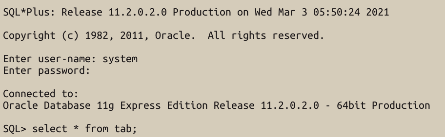

Workbench, sequel pro를 aws로 연결해서 sql을 연습하다 oracle을 연습해보고 싶어졌다. 허나 oracle에 가보니 오라클 18c Express Edition이 윈도우만 지원하는것 보고 하늘이시여.. 또 몇시간 블로그 보며 파해쳐야 겠구나 했다. 

오늘은 Mac_Lover들이 oracle을 docker로 다운로드 하는 방법을 포스팅 해보려고 한다. 

우선 크게 보면 

**1. Docker 설치**

**2. Terminal 에서 oracle 11g 설치**

**3. SQL Plus 실행하기**

로 보면 되겠다.

**1. Docker 설치**
- https://www.docker.com/products/docker-desktop
1-1. 도커를 다운로드 하면 앱에서 창에 복붙해야하는 명령어가 뜬다. 그 명령어를 터미널 창에 복붙하자.

1-2. 복붙이 끝나고 실행이 되면 우측 상단과 중간 사이에 귀여운 고래 모양이 뜬다. 고래 모양이 뜨면 잘 실행되고 있다는 것.

**2. Terminal 에서 oracle 11g 설치하기.**
2-1. 터미널에서 **docker search oracle-xe-11g** 명령어를 입력해서 다운로드 할 이미지를 검색한다.검색한 이미지 목록을 밑으로 쭉 내리다 보면 jaspeen/oracle-xe-11g가 보일텐데 이 것을 사용해서 이미지를 다운로드 해보자.

2-2. docker pull jaspeen/oracle-xe-11g 명령어를 입력하면 아래와 같은 화면이 나타난다.

2-3. docker images 명령어를 사용하여 jaspeen/oracle-xe-11g 이미지가 다운로드 되었는지 확인한다.

2-4. 이제 컨테이너 생성을 해 볼 차례이다.
**docker run --name oracle -d -p 8080:8080 -p 1521:1521 jaspeen/oracle-xe-11g** 명령어를 입력하여 컨테이너의 생성과 실행을 해준다.
여기서 **oracle 은 임의로 설정한 컨테이너의 이름**으로, 본인이 원하는 이름을 넣어 명령문을 작성하면 된다.내가 입력한 oracle 의 컨테이너가 생성되고
**docker ps**를 입력해서 컨테이너가 제대로 실행되는지 (NAMES에 지정한 이름이 뜨는지) 확인한다.

2-5. **docker exec -it oracle sqlplus** 명령문으로 sqlplus를 시작할 수 있다.여기서 oracle 은 컨테이너를 생성할때 만든 임의의 컨테이너 이름으로, 각자가 정한 이름을 넣어주면 된다.
2-6. Enter user-name : 에는 **system** 을 입력하고 Enter password: 에는 본인이 원하는 비번을 입력하면 되는데 비밀번호는 입력해도 화면상으로 보이지 않기 때문에 오타에 유의한다.둘 다 정확히 입력했다면 Connecte to: 와 함께 SQL> 이 뜬다

**3. SQLPlus가 실행된다.**