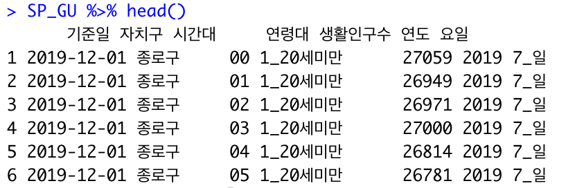
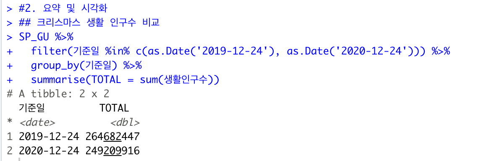
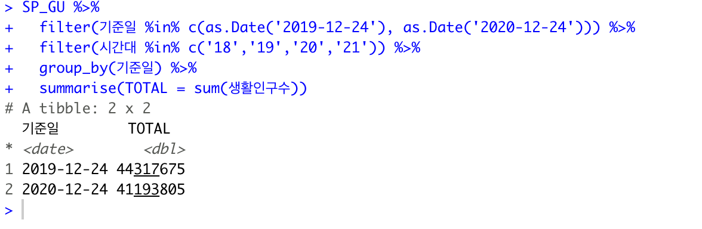
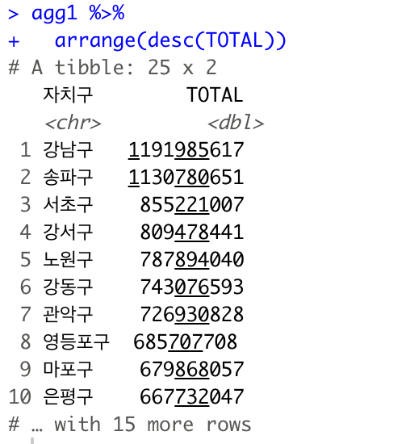
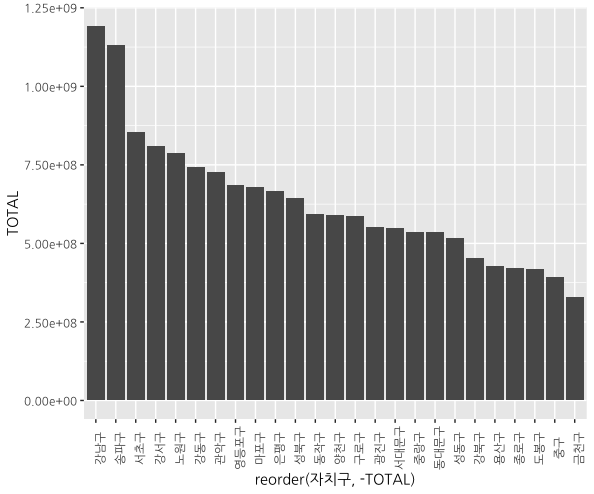
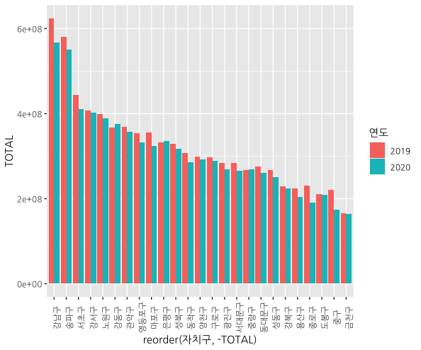
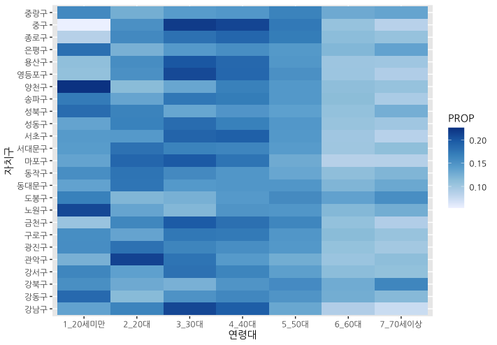
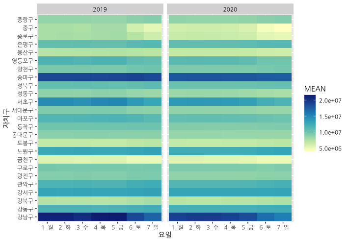
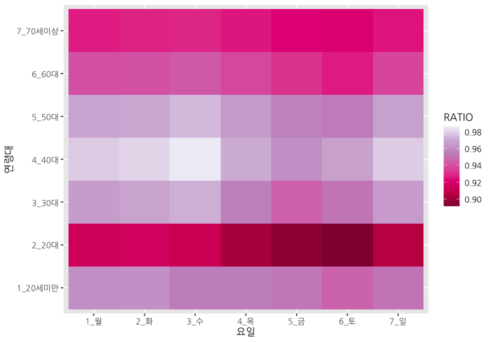

- 프로젝트: 서울시 생활 인구 변화 분석
- 분석목표: 서울시 생활 인구 2019년 2020년 데이터 EDA 분석, 시각화 
- 분석환경:
1. dplyr ==  1.0.4
2. ggplot2 == 3.3.3
3. extrafont ==  0.17
- 담당업무: EDA, 프로젝트 기획, 시각화
## 1. 전처리
```R
library(dplyr)
library(ggplot2)

data_2019 = read.csv('data/SEOUL_PEOPLE_GU_2019.csv', fileEncoding = 'UTF-8', colClasses=c('시간대'='character'))
data_2020 = read.csv('data/SEOUL_PEOPLE_GU_2020.csv', fileEncoding = 'UTF-8', colClasses=c('시간대'='character'))
data_2019 %>% head()
data_2020 %>% head()

#1. 전처리
## 2개로 나눠진 데이터를 하나의 데이터로 합치자. 
SP_GU = rbind(data_2019, data_2020)
SP_GU %>% head(10)
SP_GU %>% tail(10)

SP_GU %>% str() #기준일의 character가 시간으로 되있는것을 알 수 있다. 

SP_GU = SP_GU %>% 
  mutate(기준일 = as.Date(기준일))
SP_GU %>% str()

SP_GU = SP_GU %>% mutate(연도 = format(기준일,'%Y'))
SP_GU = SP_GU %>% mutate(요일 = format(기준일, '%u_%a'))
SP_GU %>% head()
```
출력 결과

## 2. 요약 및 시각화
매년 가장 핫한 holiday는 당연 크리스마스다. 당연 2019의 크리스마스 날 서울 인구 활동은 2020의 크리스마스 서울 인구 활동보다 많을 것이라고 예상하고 코드를 짜보자.
```R
SP_GU %>% 
  filter(기준일 %in% c(as.Date('2019-12-24'), as.Date('2020-12-24'))) %>% 
  group_by(기준일) %>% 
  summarise(TOTAL = sum(생활인구수))
```

예상했던 데로 2019의 서울이 더 활발하게 움직이는 것을 볼 수 있다. 허나 결과가 조금 이상하다... 우리나라가 중국도 아니고 인구가 2억 명이 넘는다.... 곰곰이 생각해 보니 한 사람이 1시에도 2시에도 3시에도 서울에서 생활을 할 수 있으므로, 중복되어 큰 숫자가 나온 것이라 유추할 수 있다. 중요한 건 2019년과 2020년의 서울 생활 양을 비교하는 것이기 때문에 상대적인 비교만 하면 될 뿐 숫자 자체에 의미를 두지 않았다.
#### 2-1. 저녁시간대의 크리스마스 이동 인구를 상대적으로 계산해 보자. 
```R
SP_GU %>% 
  filter(기준일 %in% c(as.Date('2019-12-24'), as.Date('2020-12-24'))) %>% 
  filter(시간대 %in% c('18','19','20','21')) %>% 
  group_by(기준일) %>% 
  summarise(TOTAL = sum(생활인구수))
```

드라마틱한 변화를 감지하진 못했다... 저녁시간의 활동 또한 2019년도가 2020에 앞섰다. 

## 3. 자치구별 생활인구수 합계 계산 / 막대그래프 시각화 
분석의 목표는 "2019년 대비 2020년의 생활인구 변화의 특성 파악"이지만 번외로 강남이 땅값이 왜 비싼 지가 궁금해졌다. 내가 알기로는 유동인구가 많아야 땅값이 오른다는데 통상적으로 강남이 항상 땅값이 높으니 당연히 강남 유동인구가 가장 많지 않을까 해서 유동인구를 분석해봤다.
```R
agg1 = SP_GU %>% 
  group_by(자치구) %>% 
  summarise(TOTAL = sum(생활인구수))
agg1 %>% 
  arrange(desc(TOTAL))
```

```R
agg1 %>% 
  ggplot(aes(자치구, TOTAL))+
  geom_col()
agg1 %>% 
  ggplot(aes(reorder(자치구,-TOTAL),TOTAL)) + 
  geom_col() +
  theme(axis.text.x = element_text(angle=90))
```

```R
agg2 = SP_GU %>% 
  group_by(연도, 자치구) %>% 
  summarise(TOTAL = sum(생활인구수))

agg2 %>%  ggplot(aes(reorder(자치구,-TOTAL),TOTAL,fill=연도)) + geom_col(position='dodge') +
  theme(axis.text.x = element_text(angle=90))
```

역시... 예상대로 강남구, 송파구, 서초구가 2019~2020 서울 유동인구 1,2,3등을 차지했다.생활인구 결과값이 비정상적으로 크게 나온건 개인별, 시간별이 중복될 뿐만 아니라 2019,2020년도를 합해서 계산했기 떄문이다. 

## 4. 2020년의 각 자치구별 생활인구의 연령대 비중 계산해보자. 나이 구간별로 생활한 장소가 다를 수 있지 않을까? 
```R
agg3 = SP_GU %>% 
  filter(연도 =='2020') %>% 
  group_by(자치구, 연령대) %>% 
  summarise(TOTAL = sum(생활인구수)) %>% 
  mutate(PROP = TOTAL/sum(TOTAL))
agg3

agg3 %>% 
  ggplot(aes(연령대, 자치구, fill=PROP))+
  geom_tile()+ scale_fill_distiller(palette = 'Blues', direction =1)
  ```
  
 비율이기 때문에 행으로 수치값을 모두 더하면 1이 된다. 색이 진하다는 뜻은 그 지역에 해당 나이 때의 행동반경이 활발했다는 뜻이다. 2020년도에는 10대는 양천구에, 20대는 관악구, 30대는 중구, 40대는 중구, 서초구, 강남구 생활 빈도가 높다는 것을 알 수 있다. 중구, 서초구 강남구는 회사가 밀집한 지역이기 때문에 30대와 40대가 당연히 많을 수밖에 없고 50대 이후부터는 색이 희미해지는 걸 보아 점점 활동량이 감소한다는 것을 유추할 수 있다.

 ## 5.연도/자치구/요일별 일평균 생활인구수 열지도 시각화
 ```R
 agg4 = SP_GU %>% 
  group_by(연도, 자치구, 요일, 기준일) %>% 
  summarise(TOTAL = sum(생활인구수))
agg4
 agg5 = agg4 %>% 
  summarise(MEAN = mean(TOTAL))
agg5

agg5 %>% 
  ggplot(aes(요일, 자치구, fill=MEAN)) +
  geom_tile()+
  facet_wrap(vars(연도))+
  scale_fill_distiller(palette = 'YlGnBu', direction =1)
 ```
  
  2019년도와 2020년도 두 해 모두 월요일부터 일요일까지 송파구와 강남구는 북적거린다. 하지만 강남구의 2019년의 색갈이 2020년의 색깔보다 더 진하다. 

  ## 6. tidyr의 spread()를 활용한 형태 변환 및 변화율 계산 
 ```R
library(tidyr)
agg5
agg5 %>% 
  spread(연도, MEAN)

agg6 = agg5 %>% 
  spread(연도, MEAN) %>% 
  mutate(RATIO = `2020`/`2019`)
agg6

agg6 %>% 
  ggplot(aes(요일, 자치구, fill=RATIO)) + 
  geom_tile() + 
  scale_fill_distiller(palette = 'Reds')
   ```
  

  ## 7. 연도/ 연령대/ 요일별 일평균 생활인구수를 계산하고 2019년 대비 2020년의 변화율을 열지도로 시각화 
```R
  agg7 = SP_GU %>% 
  group_by(연도, 연령대, 요일, 기준일) %>% 
  summarise(TOTAL = sum(생활인구수))
agg8 = agg7 %>% 
  summarise(MEAN = mean(TOTAL))
agg8
agg9 = agg8 %>% 
  spread(연도, MEAN) %>% 
  mutate(RATIO = `2020`/`2019`)
agg9
agg9 %>% 
  ggplot(aes(요일, 연령대,fill=RATIO)) + 
  geom_tile()+
  scale_fill_distiller(palette = "Reds")
```

2019년에 비해 2020년에 생활 반경이 줄어든 나이대는 20대, 60대, 70대인걸 볼 수 있다. 코로나가 터져도 30대, 40대, 50대는 직장을 다녀야 하기 때문에 다른 나이때보다 생활 반경에 영향을 덜 받지 않았나 유추해볼 수 있을것같다. 
또한 전반적으로 서울 전 연령대에 붉은색이 띄는 것을 보아 1이상이 넘는 즉 2019년보다 2020년에 서울에서의 인구 활동이 줄어들었다는 것을 볼 수 있고 그 뜻은 경기권이나 타 지역에서 서울로 유입되는 사람들이 줄어들었다라고 해석할 수도 있겠다.

7가지 방법으로 2019년도와 2020년도의 서울시 인구생활량을 분석해봤고 역시 예상했던 데로 2019년이 2020년도보다 활동량이 많았다.
지역적으로 본다면 강남구, 송파구, 서초구가 가장 활동량이 많았으며 나이대를 본다면 30대~40대의 활동량이 가장 많았다. 즉 종합해 본다면 일을 하기 위한 활동량을 코로나로 많은 영향을 받지 않은 것을 분석을 통해 알 수 있었다.