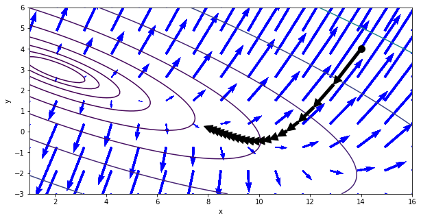

함수 f(x,y) = $2x^2 + 6xy + 7y^2 -26x -54y + 107$로 표현되는 지형을 그래프로 나타내고, 지형의 (14,4)지점에 공을 두었다면 어떤 경로로 공이 움직일지 경로를 그려라


```python
import matplotlib.pyplot as plt
import numpy as np
import sympy
import matplotlib as mpl
import scipy as sp
import pandas as pd
```


```python
black = {'facecolor':'black'}
def f(x,y):
    return 2*x**2+6*x*y+7*y**2-26*x-54*y+107
xx = np.linspace(1,16,100)
yy = np.linspace(-3,6,90)
X, Y = np.meshgrid(xx,yy)
Z=f(X,Y)

def gx(x,y):
    return 4*x+6*y-26
def gy(x,y):
    return 6*x+14*y-54

xx2 = np.linspace(1,16,15)
yy2 = np.linspace(-3,6,9)
X2,Y2 = np.meshgrid(xx2,yy2)
GX = gx(X2,Y2)
GY = gy(X2,Y2)
plt.figure(figsize=(10,5))
plt.contour(X,Y,Z, levels=np.logspace(0,3,10))

x0=(14,4)
plt.plot(x0[0],x0[1],'ko',ms=10)

for i in range(20):
    g=np.array((gx(x0[0],x0[1]),gy(x0[0],x0[1])))
    x_next= x0-0.02*g
    plt.annotate('',xy=x_next,xytext=x0,arrowprops=black)
    x0= x_next
    plt.quiver(X2,Y2,GX,GY,color='blue', scale=400, minshaft=2)

plt.xlabel('x')
plt.ylabel('y')

plt.show()
```





