"원티드 에듀" 서류 지원했을 때 주어진 과제가 주가 데이터 분석이었다. <br>
오늘 서류 면접 결과를 기다리면서 과제 프로젝트를 했을 때 혹시 데이터 탐색시 발견하지 못한 점이 있지 않은지 확인차 시각화하며 데이터를 음미(?)했다.<br>
데이터를 보며 인사이트를 도출하는 과정만큼 희열을 주는 일을 찾기 힘든것같다. <br> 원티드 에듀 서류면접은 합격했다 :)


```python
import pandas as pd
import seaborn as sns
```


```python
df = pd.read_csv('krx.csv', dtype={"Symbol":object})
```

## 전체 데이터 요약, 관계성, 타입, 행&열 갯수 분석

- krx 컬럼 이름 해석 <br>
{'회사명':'Name', <br>
'종목코드':'Symbol', <br>
'업종':'Sector', <br>
'주요제품':'Industry', <br>
'상장일':'ListingDate', <br>
'결산월':'SettleMonth',  <br>
'대표자명':'Representative', <br>
'홈페이지':'HomePage', <br>
'지역':'Region', }


```python
df.shape
```


    (7211, 11)


```python
# head 로 위에 있는 데이터 일부만 가져옵니다.
df.head()
```


<div>
<style scoped>
    .dataframe tbody tr th:only-of-type {
        vertical-align: middle;
    }

    .dataframe tbody tr th {
        vertical-align: top;
    }

    .dataframe thead th {
        text-align: right;
    }
</style>
<table border="1" class="dataframe">
  <thead>
    <tr style="text-align: right;">
      <th></th>
      <th>Symbol</th>
      <th>Market</th>
      <th>Name</th>
      <th>Sector</th>
      <th>Industry</th>
      <th>ListingDate</th>
      <th>SettleMonth</th>
      <th>Representative</th>
      <th>HomePage</th>
      <th>Region</th>
    </tr>
  </thead>
  <tbody>
    <tr>
      <th>0</th>
      <td>060310</td>
      <td>KOSDAQ</td>
      <td>3S</td>
      <td>특수 목적용 기계 제조업</td>
      <td>반도체 웨이퍼 캐리어</td>
      <td>2002-04-23</td>
      <td>03월</td>
      <td>박종익, 김세완 (각자 대표이사)</td>
      <td>http://www.3sref.com</td>
      <td>서울특별시</td>
    </tr>
    <tr>
      <th>1</th>
      <td>095570</td>
      <td>KOSPI</td>
      <td>AJ네트웍스</td>
      <td>산업용 기계 및 장비 임대업</td>
      <td>렌탈(파렛트, OA장비, 건설장비)</td>
      <td>2015-08-21</td>
      <td>12월</td>
      <td>이현우, 박대현</td>
      <td>http://www.ajnet.co.kr</td>
      <td>서울특별시</td>
    </tr>
    <tr>
      <th>2</th>
      <td>006840</td>
      <td>KOSPI</td>
      <td>AK홀딩스</td>
      <td>기타 금융업</td>
      <td>지주사업</td>
      <td>1999-08-11</td>
      <td>12월</td>
      <td>채형석, 이석주(각자 대표이사)</td>
      <td>http://www.aekyunggroup.co.kr</td>
      <td>서울특별시</td>
    </tr>
    <tr>
      <th>3</th>
      <td>054620</td>
      <td>KOSDAQ</td>
      <td>APS홀딩스</td>
      <td>기타 금융업</td>
      <td>인터넷 트래픽 솔루션</td>
      <td>2001-12-04</td>
      <td>12월</td>
      <td>정기로</td>
      <td>http://www.apsholdings.co.kr</td>
      <td>경기도</td>
    </tr>
    <tr>
      <th>4</th>
      <td>265520</td>
      <td>KOSDAQ</td>
      <td>AP시스템</td>
      <td>특수 목적용 기계 제조업</td>
      <td>디스플레이 제조 장비</td>
      <td>2017-04-07</td>
      <td>12월</td>
      <td>김영주</td>
      <td>http://www.apsystems.co.kr</td>
      <td>경기도</td>
    </tr>
  </tbody>
</table>
</div>


```python
# tail 로 아래 있는 데이터 일부만 가져옵니다.
df.tail()
```


<div>
<style scoped>
    .dataframe tbody tr th:only-of-type {
        vertical-align: middle;
    }

    .dataframe tbody tr th {
        vertical-align: top;
    }

    .dataframe thead th {
        text-align: right;
    }
</style>
<table border="1" class="dataframe">
  <thead>
    <tr style="text-align: right;">
      <th></th>
      <th>Symbol</th>
      <th>Market</th>
      <th>Name</th>
      <th>Sector</th>
      <th>Industry</th>
      <th>ListingDate</th>
      <th>SettleMonth</th>
      <th>Representative</th>
      <th>HomePage</th>
      <th>Region</th>
    </tr>
  </thead>
  <tbody>
    <tr>
      <th>7206</th>
      <td>000547</td>
      <td>KOSPI</td>
      <td>흥국화재2우B</td>
      <td>NaN</td>
      <td>NaN</td>
      <td>NaN</td>
      <td>NaN</td>
      <td>NaN</td>
      <td>NaN</td>
      <td>NaN</td>
    </tr>
    <tr>
      <th>7207</th>
      <td>000545</td>
      <td>KOSPI</td>
      <td>흥국화재우</td>
      <td>NaN</td>
      <td>NaN</td>
      <td>NaN</td>
      <td>NaN</td>
      <td>NaN</td>
      <td>NaN</td>
      <td>NaN</td>
    </tr>
    <tr>
      <th>7208</th>
      <td>003280</td>
      <td>KOSPI</td>
      <td>흥아해운</td>
      <td>해상 운송업</td>
      <td>외항화물운송업(케미컬탱커)</td>
      <td>1976-06-29</td>
      <td>12월</td>
      <td>이환구</td>
      <td>http://www.heung-a.com</td>
      <td>서울특별시</td>
    </tr>
    <tr>
      <th>7209</th>
      <td>037440</td>
      <td>KOSDAQ</td>
      <td>희림</td>
      <td>건축기술, 엔지니어링 및 관련 기술 서비스업</td>
      <td>설계 및 감리용역</td>
      <td>2000-02-03</td>
      <td>12월</td>
      <td>정영균, 이목운, 허철호 (각자대표)</td>
      <td>http://www.heerim.com</td>
      <td>서울특별시</td>
    </tr>
    <tr>
      <th>7210</th>
      <td>238490</td>
      <td>KOSDAQ</td>
      <td>힘스</td>
      <td>특수 목적용 기계 제조업</td>
      <td>OLED Mask 인장기, OLED Mask 검사기 등</td>
      <td>2017-07-20</td>
      <td>12월</td>
      <td>김주환</td>
      <td>http://www.hims.co.kr</td>
      <td>인천광역시</td>
    </tr>
  </tbody>
</table>
</div>


```python
df.sample()
```


<div>
<style scoped>
    .dataframe tbody tr th:only-of-type {
        vertical-align: middle;
    }

    .dataframe tbody tr th {
        vertical-align: top;
    }

    .dataframe thead th {
        text-align: right;
    }
</style>
<table border="1" class="dataframe">
  <thead>
    <tr style="text-align: right;">
      <th></th>
      <th>Symbol</th>
      <th>Market</th>
      <th>Name</th>
      <th>Sector</th>
      <th>Industry</th>
      <th>ListingDate</th>
      <th>SettleMonth</th>
      <th>Representative</th>
      <th>HomePage</th>
      <th>Region</th>
      <th>ListingYear</th>
    </tr>
  </thead>
  <tbody>
    <tr>
      <th>3695</th>
      <td>045300</td>
      <td>KOSDAQ</td>
      <td>성우테크론</td>
      <td>전자부품 제조업</td>
      <td>리드프레임가공, 반도체 장비</td>
      <td>2001-12-18</td>
      <td>12월</td>
      <td>박찬홍</td>
      <td>http://www.swmv.co.kr</td>
      <td>경상남도</td>
      <td>2001.0</td>
    </tr>
  </tbody>
</table>
</div>


```python
# info 로 요약 데이터를 봅니다.
df.info()
```

    <class 'pandas.core.frame.DataFrame'>
    RangeIndex: 7211 entries, 0 to 7210
    Data columns (total 10 columns):
     #   Column          Non-Null Count  Dtype 
    ---  ------          --------------  ----- 
     0   Symbol          7211 non-null   object
     1   Market          7211 non-null   object
     2   Name            7211 non-null   object
     3   Sector          2438 non-null   object
     4   Industry        2419 non-null   object
     5   ListingDate     2438 non-null   object
     6   SettleMonth     2438 non-null   object
     7   Representative  2438 non-null   object
     8   HomePage        2258 non-null   object
     9   Region          2438 non-null   object
    dtypes: object(10)
    memory usage: 563.5+ KB


```python
# describe 로 기술통계값을 봅니다.
df.describe()
```


<div>
<style scoped>
    .dataframe tbody tr th:only-of-type {
        vertical-align: middle;
    }

    .dataframe tbody tr th {
        vertical-align: top;
    }

    .dataframe thead th {
        text-align: right;
    }
</style>
<table border="1" class="dataframe">
  <thead>
    <tr style="text-align: right;">
      <th></th>
      <th>Symbol</th>
      <th>Market</th>
      <th>Name</th>
      <th>Sector</th>
      <th>Industry</th>
      <th>ListingDate</th>
      <th>SettleMonth</th>
      <th>Representative</th>
      <th>HomePage</th>
      <th>Region</th>
    </tr>
  </thead>
  <tbody>
    <tr>
      <th>count</th>
      <td>7211</td>
      <td>7211</td>
      <td>7211</td>
      <td>2438</td>
      <td>2419</td>
      <td>2438</td>
      <td>2438</td>
      <td>2438</td>
      <td>2258</td>
      <td>2438</td>
    </tr>
    <tr>
      <th>unique</th>
      <td>7211</td>
      <td>3</td>
      <td>7211</td>
      <td>158</td>
      <td>2264</td>
      <td>1799</td>
      <td>9</td>
      <td>2319</td>
      <td>2237</td>
      <td>22</td>
    </tr>
    <tr>
      <th>top</th>
      <td>308100</td>
      <td>KOSPI</td>
      <td>미래FH92KOSPI200풋</td>
      <td>특수 목적용 기계 제조업</td>
      <td>기업인수합병</td>
      <td>1976-06-30</td>
      <td>12월</td>
      <td>-</td>
      <td>http://imt@kmaringroup.com</td>
      <td>서울특별시</td>
    </tr>
    <tr>
      <th>freq</th>
      <td>1</td>
      <td>5555</td>
      <td>1</td>
      <td>144</td>
      <td>37</td>
      <td>8</td>
      <td>2378</td>
      <td>5</td>
      <td>2</td>
      <td>987</td>
    </tr>
  </tbody>
</table>
</div>


```python
# 중복을 제외한 unique 값의 갯수를 봅니다.
df.nunique()
```


    Symbol            7211
    Market               3
    Name              7211
    Sector             158
    Industry          2264
    ListingDate       1799
    SettleMonth          9
    Representative    2319
    HomePage          2237
    Region              22
    dtype: int64


```python
# index 값 보기
df.index
```


    RangeIndex(start=0, stop=7211, step=1)


```python
# 컬럼값 보기
df.columns
```


    Index(['Symbol', 'Market', 'Name', 'Sector', 'Industry', 'ListingDate',
           'SettleMonth', 'Representative', 'HomePage', 'Region'],
          dtype='object')


```python
# 값만 보기
df.values
```


    array([['060310', 'KOSDAQ', '3S', ..., '박종익, 김세완 (각자 대표이사)',
            'http://www.3sref.com', '서울특별시'],
           ['095570', 'KOSPI', 'AJ네트웍스', ..., '이현우, 박대현',
            'http://www.ajnet.co.kr', '서울특별시'],
           ['006840', 'KOSPI', 'AK홀딩스', ..., '채형석, 이석주(각자 대표이사)',
            'http://www.aekyunggroup.co.kr', '서울특별시'],
           ...,
           ['003280', 'KOSPI', '흥아해운', ..., '이환구', 'http://www.heung-a.com',
            '서울특별시'],
           ['037440', 'KOSDAQ', '희림', ..., '정영균, 이목운, 허철호 (각자대표)',
            'http://www.heerim.com', '서울특별시'],
           ['238490', 'KOSDAQ', '힘스', ..., '김주환', 'http://www.hims.co.kr',
            '인천광역시']], dtype=object)


## 1개의 컬럼 변수로 데이터 탐색


```python
# 카카오를 찾습니다.
df["Name"] == "카카오" #어딘가에 카카오가 숨어있다.
```


    0       False
    1       False
    2       False
    3       False
    4       False
            ...  
    7206    False
    7207    False
    7208    False
    7209    False
    7210    False
    Name: Name, Length: 7211, dtype: bool


```python
df[df["Name"] == "카카오"] #True인 index값을 indexing해서 가져온다.
```


<div>
<style scoped>
    .dataframe tbody tr th:only-of-type {
        vertical-align: middle;
    }

    .dataframe tbody tr th {
        vertical-align: top;
    }

    .dataframe thead th {
        text-align: right;
    }
</style>
<table border="1" class="dataframe">
  <thead>
    <tr style="text-align: right;">
      <th></th>
      <th>Symbol</th>
      <th>Market</th>
      <th>Name</th>
      <th>Sector</th>
      <th>Industry</th>
      <th>ListingDate</th>
      <th>SettleMonth</th>
      <th>Representative</th>
      <th>HomePage</th>
      <th>Region</th>
    </tr>
  </thead>
  <tbody>
    <tr>
      <th>4716</th>
      <td>035720</td>
      <td>KOSPI</td>
      <td>카카오</td>
      <td>자료처리, 호스팅, 포털 및 기타 인터넷 정보매개 서비스업</td>
      <td>인터넷 서비스(인터넷 광고)</td>
      <td>2017-07-10</td>
      <td>12월</td>
      <td>여민수, 조수용</td>
      <td>http://www.kakaocorp.com</td>
      <td>제주특별자치도</td>
    </tr>
  </tbody>
</table>
</div>


```python
# 서울특별시에 소재지를 두고 있는 KOSPI 종목의 종목명과 심볼을 가져옵니다.
df.loc[(df["Region"] == "서울특별시") & (df["Market"] == "KOSPI"), ["Symbol", "Name"]]
```


<div>
<style scoped>
    .dataframe tbody tr th:only-of-type {
        vertical-align: middle;
    }

    .dataframe tbody tr th {
        vertical-align: top;
    }

    .dataframe thead th {
        text-align: right;
    }
</style>
<table border="1" class="dataframe">
  <thead>
    <tr style="text-align: right;">
      <th></th>
      <th>Symbol</th>
      <th>Name</th>
    </tr>
  </thead>
  <tbody>
    <tr>
      <th>1</th>
      <td>095570</td>
      <td>AJ네트웍스</td>
    </tr>
    <tr>
      <th>2</th>
      <td>006840</td>
      <td>AK홀딩스</td>
    </tr>
    <tr>
      <th>47</th>
      <td>027410</td>
      <td>BGF</td>
    </tr>
    <tr>
      <th>48</th>
      <td>282330</td>
      <td>BGF리테일</td>
    </tr>
    <tr>
      <th>50</th>
      <td>001460</td>
      <td>BYC</td>
    </tr>
    <tr>
      <th>...</th>
      <td>...</td>
      <td>...</td>
    </tr>
    <tr>
      <th>7194</th>
      <td>079980</td>
      <td>휴비스</td>
    </tr>
    <tr>
      <th>7196</th>
      <td>005010</td>
      <td>휴스틸</td>
    </tr>
    <tr>
      <th>7200</th>
      <td>069260</td>
      <td>휴켐스</td>
    </tr>
    <tr>
      <th>7205</th>
      <td>000540</td>
      <td>흥국화재</td>
    </tr>
    <tr>
      <th>7208</th>
      <td>003280</td>
      <td>흥아해운</td>
    </tr>
  </tbody>
</table>
<p>407 rows × 2 columns</p>
</div>


## 파생변수 만들기


```python
df.columns
```


    Index(['Symbol', 'Market', 'Name', 'Sector', 'Industry', 'ListingDate',
           'SettleMonth', 'Representative', 'HomePage', 'Region', 'ListingYear'],
          dtype='object')


```python
# ListingYear 파생변수 만들기
df["ListingDate"] = pd.to_datetime(df["ListingDate"])
df["ListingYear"] = df["ListingDate"].dt.year
df["ListingYear"]
```


    0       2002.0
    1       2015.0
    2       1999.0
    3       2001.0
    4       2017.0
             ...  
    7206       NaN
    7207       NaN
    7208    1976.0
    7209    2000.0
    7210    2017.0
    Name: ListingYear, Length: 7211, dtype: float64


```python
df.info()
```

    <class 'pandas.core.frame.DataFrame'>
    RangeIndex: 7211 entries, 0 to 7210
    Data columns (total 11 columns):
     #   Column          Non-Null Count  Dtype         
    ---  ------          --------------  -----         
     0   Symbol          7211 non-null   object        
     1   Market          7211 non-null   object        
     2   Name            7211 non-null   object        
     3   Sector          2438 non-null   object        
     4   Industry        2419 non-null   object        
     5   ListingDate     2438 non-null   datetime64[ns]
     6   SettleMonth     2438 non-null   object        
     7   Representative  2438 non-null   object        
     8   HomePage        2258 non-null   object        
     9   Region          2438 non-null   object        
     10  ListingYear     2438 non-null   float64       
    dtypes: datetime64[ns](1), float64(1), object(9)
    memory usage: 619.8+ KB


```python
df[["ListingYear", "ListingDate"]].dtypes
```


    ListingYear           float64
    ListingDate    datetime64[ns]
    dtype: object


## 데이터 시각화를 위한 폰트설정

1. 플랫폼 모듈 임포트
2. 모듈 임포트안에있는 함수 system()으로 통해 각 CPU에 맞는 시스템 이름 호출
3. 시스템 이름에 맞는 폰트 이름 변수에 입력. 
4. 그 폰트 이름을 plt안에 있는 rc()함수 attribute "family"에 입력


```python
def get_font_family():
    """
    시스템 환경에 따른 기본 폰트명을 반환하는 함수
    """
    import platform
    system_name = platform.system()
    # colab 사용자는 system_name이 'Linux'로 확인

    if system_name == "Darwin" :
        font_family = "AppleGothic"
    elif system_name == "Windows":
        font_family = "Malgun Gothic"
    else:
        # Linux
        # colab에서는 runtime을 <꼭> 재시작 해야함.
        # 런타임을 재시작 하지 않고 폰트 설치를 하면 기본 설정 폰트가 로드되어 한글이 깨짐.
        !apt-get update -qq
        !apt-get install fonts-nanum -qq  > /dev/null

        import matplotlib.font_manager as fm

        fontpath = '/usr/share/fonts/truetype/nanum/NanumBarunGothic.ttf'
        font = fm.FontProperties(fname=fontpath, size=9)
        fm._rebuild()
        font_family = "NanumBarunGothic"
    return font_family
```


```python
get_font_family()
```


    'AppleGothic'


```python
# 시각화를 위한 폰트설정
# 위에서 만든 함수를 통해 시스템 폰트를 불러와서 font_family 라는 변수에 할당.
a = get_font_family()
# 폰트설정
import matplotlib.pyplot as plt 
plt.rc("font", family = a)
# 마이너스폰트 설정
plt.rc("axes", unicode_minus=False)
# ggplot으로 그래프 스타일 설정
plt.style.use("ggplot")
```

### 폰트 설정 확인하기


```python
# 한글폰트 확인하기
pd.Series([1,3,5,7,9]).plot(title="한글폰트")
```


    <matplotlib.axes._subplots.AxesSubplot at 0x1a2488cc10>


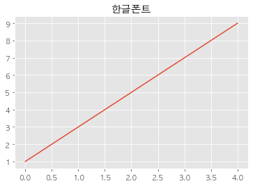


## 한 개의 변수 빈도수 구하고 시각화 하기
* Keyword

    * Series.value_counts()
    * Series.value_counts().plot()
    * Series.value_counts().plot.bar()
    * Series.value_counts().plot.barh()
    * sns.countplot()


```python
# Market column에 어떤 데이터들이 있는지 unique로 확인하기.
df["Market"].unique()
```


    array(['KOSDAQ', 'KOSPI', 'KONEX'], dtype=object)


```python
# value_counts()로 빈도수를 구함.
df["Market"].value_counts()
```


    KOSPI     5555
    KOSDAQ    1518
    KONEX      138
    Name: Market, dtype: int64


```python
# 빈도수를 시각화 함.
df["Market"].sort_values().value_counts().plot.barh(rot=30)
```


    <matplotlib.axes._subplots.AxesSubplot at 0x1a247a3850>


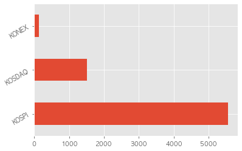


```python
# Seaborn countplot 활용하여 빈도수를 표현합니다.
sns.countplot(data = df, y = "Market")
```


    <matplotlib.axes._subplots.AxesSubplot at 0x1a24602950>


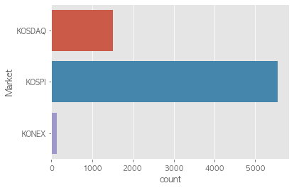


### Sector (종류가 많을 시 상위 30개만 추려 시각화)


```python
# 섹터의 빈도수를 구하고
# 상위 30개 섹터의 빈도수를 sector_count_top 변수에 할당.
sector_count_top = df["Sector"].value_counts().head(30)
sector_count_top.index
```


    Index(['특수 목적용 기계 제조업', '소프트웨어 개발 및 공급업', '전자부품 제조업', '자동차 신품 부품 제조업',
           '의약품 제조업', '기타 금융업', '기타 화학제품 제조업', '금융 지원 서비스업', '통신 및 방송 장비 제조업',
           '반도체 제조업', '1차 철강 제조업', '자연과학 및 공학 연구개발업', '의료용 기기 제조업',
           '일반 목적용 기계 제조업', '플라스틱제품 제조업', '기타 전문 도매업', '기초 화학물질 제조업',
           '기초 의약물질 및 생물학적 제제 제조업', '컴퓨터 프로그래밍, 시스템 통합 및 관리업',
           '전동기, 발전기 및 전기 변환 · 공급 · 제어 장치 제조업', '영화, 비디오물, 방송프로그램 제작 및 배급업',
           '기타 식품 제조업', '의료용품 및 기타 의약 관련제품 제조업', '봉제의복 제조업', '기타 금속 가공제품 제조업',
           '기계장비 및 관련 물품 도매업', '측정, 시험, 항해, 제어 및 기타 정밀기기 제조업; 광학기기 제외', '건물 건설업',
           '구조용 금속제품, 탱크 및 증기발생기 제조업', '자료처리, 호스팅, 포털 및 기타 인터넷 정보매개 서비스업'],
          dtype='object')


```python
df_sector_30 = df[df["Sector"].isin(sector_count_top.index)]
```


```python
# Seaborn countplot 활용하여 빈도수를 표현합니다.
plt.figure(figsize = (10,8))
sns.countplot(data = df_sector_30, y="Sector", palette = "Blues_r",
              order=sector_count_top.index).set_title("섹터별 빈도수")
```


    Text(0.5, 1.0, '섹터별 빈도수')


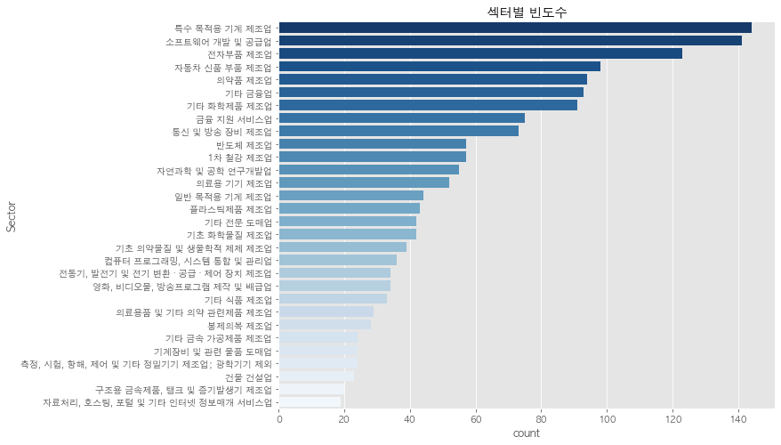


```python
#색깔바꾸기 옵션.
print(plt.colormaps())
```

    ['Accent', 'Accent_r', 'Blues', 'Blues_r', 'BrBG', 'BrBG_r', 'BuGn', 'BuGn_r', 'BuPu', 'BuPu_r', 'CMRmap', 'CMRmap_r', 'Dark2', 'Dark2_r', 'GnBu', 'GnBu_r', 'Greens', 'Greens_r', 'Greys', 'Greys_r', 'OrRd', 'OrRd_r', 'Oranges', 'Oranges_r', 'PRGn', 'PRGn_r', 'Paired', 'Paired_r', 'Pastel1', 'Pastel1_r', 'Pastel2', 'Pastel2_r', 'PiYG', 'PiYG_r', 'PuBu', 'PuBuGn', 'PuBuGn_r', 'PuBu_r', 'PuOr', 'PuOr_r', 'PuRd', 'PuRd_r', 'Purples', 'Purples_r', 'RdBu', 'RdBu_r', 'RdGy', 'RdGy_r', 'RdPu', 'RdPu_r', 'RdYlBu', 'RdYlBu_r', 'RdYlGn', 'RdYlGn_r', 'Reds', 'Reds_r', 'Set1', 'Set1_r', 'Set2', 'Set2_r', 'Set3', 'Set3_r', 'Spectral', 'Spectral_r', 'Wistia', 'Wistia_r', 'YlGn', 'YlGnBu', 'YlGnBu_r', 'YlGn_r', 'YlOrBr', 'YlOrBr_r', 'YlOrRd', 'YlOrRd_r', 'afmhot', 'afmhot_r', 'autumn', 'autumn_r', 'binary', 'binary_r', 'bone', 'bone_r', 'brg', 'brg_r', 'bwr', 'bwr_r', 'cividis', 'cividis_r', 'cool', 'cool_r', 'coolwarm', 'coolwarm_r', 'copper', 'copper_r', 'cubehelix', 'cubehelix_r', 'flag', 'flag_r', 'gist_earth', 'gist_earth_r', 'gist_gray', 'gist_gray_r', 'gist_heat', 'gist_heat_r', 'gist_ncar', 'gist_ncar_r', 'gist_rainbow', 'gist_rainbow_r', 'gist_stern', 'gist_stern_r', 'gist_yarg', 'gist_yarg_r', 'gnuplot', 'gnuplot2', 'gnuplot2_r', 'gnuplot_r', 'gray', 'gray_r', 'hot', 'hot_r', 'hsv', 'hsv_r', 'icefire', 'icefire_r', 'inferno', 'inferno_r', 'jet', 'jet_r', 'magma', 'magma_r', 'mako', 'mako_r', 'nipy_spectral', 'nipy_spectral_r', 'ocean', 'ocean_r', 'pink', 'pink_r', 'plasma', 'plasma_r', 'prism', 'prism_r', 'rainbow', 'rainbow_r', 'rocket', 'rocket_r', 'seismic', 'seismic_r', 'spring', 'spring_r', 'summer', 'summer_r', 'tab10', 'tab10_r', 'tab20', 'tab20_r', 'tab20b', 'tab20b_r', 'tab20c', 'tab20c_r', 'terrain', 'terrain_r', 'twilight', 'twilight_r', 'twilight_shifted', 'twilight_shifted_r', 'viridis', 'viridis_r', 'vlag', 'vlag_r', 'winter', 'winter_r']


```python
sector_value_counts = df["Sector"].value_counts()
```


```python
sector_value_counts.to_frame().plot.kde()
```


    <matplotlib.axes._subplots.AxesSubplot at 0x1a2e2cb350>


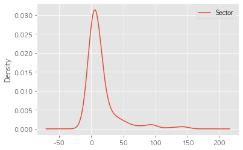


### Industry


```python
# Industry 의 빈도수를 구합니다.
industry_top_30 = df["Industry"].value_counts().head(30)
industry_top_30.index
```


    Index(['기업인수합병', '지주회사', '지주사업', '기업 인수 및 합병', '기업인수 및 합병', '화장품', '모바일게임',
           '벤처캐피탈', '금융지원 서비스', '자동차부품', '금융지원서비스', '의약품', '도급공사', '합병', '건강기능식품',
           '-', '셋톱박스', '증권업', '금융지주회사', '의료정보시스템', '배합사료', '사료',
           '부동산투자, 취득, 매매, 임대', '이미지센서 패키징', '항체치료제', '플라스틱 필름', '소주', '비금융지주회사',
           '도시가스', '금융 지원 서비스'],
          dtype='object')


```python
industry_top_30
```


    기업인수합병               37
    지주회사                 19
    지주사업                  9
    기업 인수 및 합병            7
    기업인수 및 합병             7
    화장품                   7
    모바일게임                 7
    벤처캐피탈                 4
    금융지원 서비스              4
    자동차부품                 3
    금융지원서비스               3
    의약품                   3
    도급공사                  3
    합병                    3
    건강기능식품                3
    -                     3
    셋톱박스                  3
    증권업                   3
    금융지주회사                3
    의료정보시스템               2
    배합사료                  2
    사료                    2
    부동산투자, 취득, 매매, 임대     2
    이미지센서 패키징             2
    항체치료제                 2
    플라스틱 필름               2
    소주                    2
    비금융지주회사               2
    도시가스                  2
    금융 지원 서비스             2
    Name: Industry, dtype: int64


```python
# Industry 빈도수를 pandas 의 plot 기능을 사용해 시각화 합니다.
industry_top_30.sort_values().plot.barh(figsize=(10,8), title = "Industry Count")
```


    <matplotlib.axes._subplots.AxesSubplot at 0x1a245101d0>


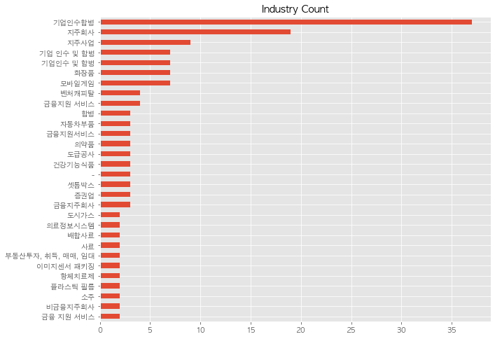


```python
df_industry_top_30 = df[df["Industry"].isin(industry_top_30.index)]
```


```python
# seaborn
plt.figure(figsize = (10,8))
sns.countplot(data = df_industry_top_30, y = "Industry", order =industry_top_30.index)
```


    <matplotlib.axes._subplots.AxesSubplot at 0x1a2cd4d710>


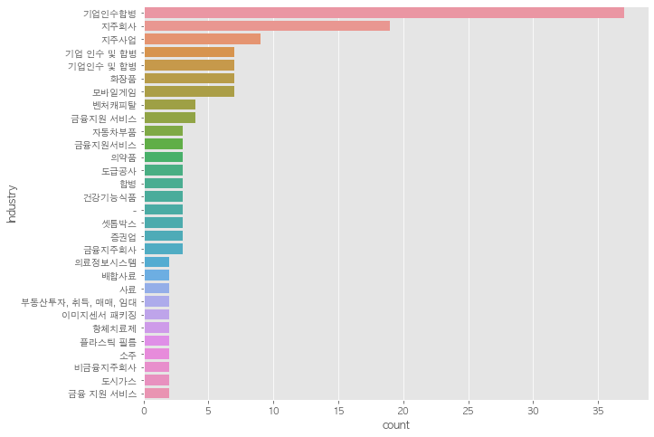


### Region 


```python
df["Region"].value_counts().index
```


    Index(['서울특별시', '경기도', '충청남도', '경상남도', '인천광역시', '충청북도', '부산광역시', '경상북도',
           '대구광역시', '대전광역시', '전라북도', '강원도', '울산광역시', '광주광역시', '전라남도', '제주특별자치도',
           '세종특별자치시', '홍콩', '미국', '케이맨 제도', '일본', '싱가포르'],
          dtype='object')


```python
# Region 의 빈도수를 구합니다.
# value_counts()통해 지역별 상장회사의 빈도수를 봅니다.
df["Region"].value_counts().sort_values().plot.barh(figsize=(10,8), title = "Region")
```


    <matplotlib.axes._subplots.AxesSubplot at 0x1a25f917d0>


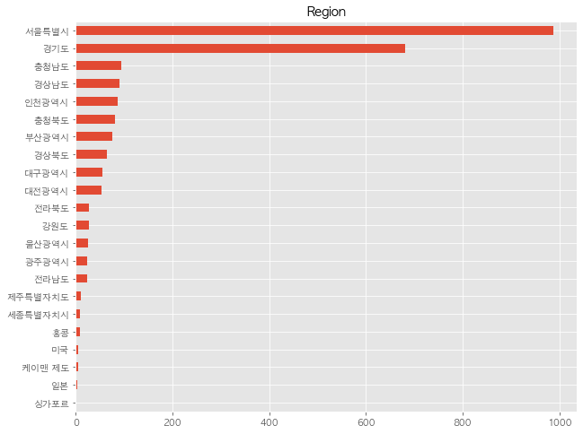


```python
Region_index = df["Region"].value_counts().index
```


```python
Region_region = df[df["Region"].isin(Region_index)]
```


<div>
<style scoped>
    .dataframe tbody tr th:only-of-type {
        vertical-align: middle;
    }

    .dataframe tbody tr th {
        vertical-align: top;
    }

    .dataframe thead th {
        text-align: right;
    }
</style>
<table border="1" class="dataframe">
  <thead>
    <tr style="text-align: right;">
      <th></th>
      <th>Symbol</th>
      <th>Market</th>
      <th>Name</th>
      <th>Sector</th>
      <th>Industry</th>
      <th>ListingDate</th>
      <th>SettleMonth</th>
      <th>Representative</th>
      <th>HomePage</th>
      <th>Region</th>
      <th>ListingYear</th>
    </tr>
  </thead>
  <tbody>
    <tr>
      <th>0</th>
      <td>060310</td>
      <td>KOSDAQ</td>
      <td>3S</td>
      <td>특수 목적용 기계 제조업</td>
      <td>반도체 웨이퍼 캐리어</td>
      <td>2002-04-23</td>
      <td>03월</td>
      <td>박종익, 김세완 (각자 대표이사)</td>
      <td>http://www.3sref.com</td>
      <td>서울특별시</td>
      <td>2002.0</td>
    </tr>
    <tr>
      <th>1</th>
      <td>095570</td>
      <td>KOSPI</td>
      <td>AJ네트웍스</td>
      <td>산업용 기계 및 장비 임대업</td>
      <td>렌탈(파렛트, OA장비, 건설장비)</td>
      <td>2015-08-21</td>
      <td>12월</td>
      <td>이현우, 박대현</td>
      <td>http://www.ajnet.co.kr</td>
      <td>서울특별시</td>
      <td>2015.0</td>
    </tr>
    <tr>
      <th>2</th>
      <td>006840</td>
      <td>KOSPI</td>
      <td>AK홀딩스</td>
      <td>기타 금융업</td>
      <td>지주사업</td>
      <td>1999-08-11</td>
      <td>12월</td>
      <td>채형석, 이석주(각자 대표이사)</td>
      <td>http://www.aekyunggroup.co.kr</td>
      <td>서울특별시</td>
      <td>1999.0</td>
    </tr>
    <tr>
      <th>3</th>
      <td>054620</td>
      <td>KOSDAQ</td>
      <td>APS홀딩스</td>
      <td>기타 금융업</td>
      <td>인터넷 트래픽 솔루션</td>
      <td>2001-12-04</td>
      <td>12월</td>
      <td>정기로</td>
      <td>http://www.apsholdings.co.kr</td>
      <td>경기도</td>
      <td>2001.0</td>
    </tr>
    <tr>
      <th>4</th>
      <td>265520</td>
      <td>KOSDAQ</td>
      <td>AP시스템</td>
      <td>특수 목적용 기계 제조업</td>
      <td>디스플레이 제조 장비</td>
      <td>2017-04-07</td>
      <td>12월</td>
      <td>김영주</td>
      <td>http://www.apsystems.co.kr</td>
      <td>경기도</td>
      <td>2017.0</td>
    </tr>
    <tr>
      <th>...</th>
      <td>...</td>
      <td>...</td>
      <td>...</td>
      <td>...</td>
      <td>...</td>
      <td>...</td>
      <td>...</td>
      <td>...</td>
      <td>...</td>
      <td>...</td>
      <td>...</td>
    </tr>
    <tr>
      <th>7204</th>
      <td>189980</td>
      <td>KOSDAQ</td>
      <td>흥국에프엔비</td>
      <td>비알코올음료 및 얼음 제조업</td>
      <td>과일음료(에이드베이스, 스무디, 착즙쥬스 등)</td>
      <td>2015-08-07</td>
      <td>12월</td>
      <td>박철범, 오길영</td>
      <td>http://www.hyungkuk.com</td>
      <td>서울특별시</td>
      <td>2015.0</td>
    </tr>
    <tr>
      <th>7205</th>
      <td>000540</td>
      <td>KOSPI</td>
      <td>흥국화재</td>
      <td>보험업</td>
      <td>손해보험</td>
      <td>1974-12-05</td>
      <td>12월</td>
      <td>권중원</td>
      <td>http://www.insurance.co.kr</td>
      <td>서울특별시</td>
      <td>1974.0</td>
    </tr>
    <tr>
      <th>7208</th>
      <td>003280</td>
      <td>KOSPI</td>
      <td>흥아해운</td>
      <td>해상 운송업</td>
      <td>외항화물운송업(케미컬탱커)</td>
      <td>1976-06-29</td>
      <td>12월</td>
      <td>이환구</td>
      <td>http://www.heung-a.com</td>
      <td>서울특별시</td>
      <td>1976.0</td>
    </tr>
    <tr>
      <th>7209</th>
      <td>037440</td>
      <td>KOSDAQ</td>
      <td>희림</td>
      <td>건축기술, 엔지니어링 및 관련 기술 서비스업</td>
      <td>설계 및 감리용역</td>
      <td>2000-02-03</td>
      <td>12월</td>
      <td>정영균, 이목운, 허철호 (각자대표)</td>
      <td>http://www.heerim.com</td>
      <td>서울특별시</td>
      <td>2000.0</td>
    </tr>
    <tr>
      <th>7210</th>
      <td>238490</td>
      <td>KOSDAQ</td>
      <td>힘스</td>
      <td>특수 목적용 기계 제조업</td>
      <td>OLED Mask 인장기, OLED Mask 검사기 등</td>
      <td>2017-07-20</td>
      <td>12월</td>
      <td>김주환</td>
      <td>http://www.hims.co.kr</td>
      <td>인천광역시</td>
      <td>2017.0</td>
    </tr>
  </tbody>
</table>
<p>2438 rows × 11 columns</p>
</div>


```python
# Region 의 빈도수를 seaborn 의 countplot 으로 그립니다.
plt.figure(figsize=(10,8))
sns.countplot(data = df, y = "Region", palette="Greens_r")
```


    <matplotlib.axes._subplots.AxesSubplot at 0x1a263faa90>


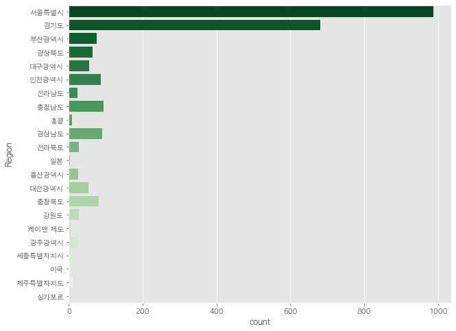


## 두 개의 변수 빈도수 구하고 시각화 하기
* crosstab 으로 빈도수 구하기
* seaborn의 countplot 으로 빈도수 시각화
* pandas의 plot 기능으로 시각화
    * lineplot : 연속된 데이터(숫자, 기간)
    * barplot : 비연속 데이터(범주형)
    * hist : 연속된 수치 데이터의 범주화

### pd.crosstab이용하여 지역별 상장 시장 종목 빈도수 구하기
* pd.crosstab 을 통한 2개의 변수에 대한 빈도수 구하기


```python
# pd.crosstab 을 통한 2개의 변수에 대한 빈도수 구하기
# Market 과 Region 으로 빈도수 구하기
pd.crosstab(df["Market"],df["Region"])
```


<div>
<style scoped>
    .dataframe tbody tr th:only-of-type {
        vertical-align: middle;
    }

    .dataframe tbody tr th {
        vertical-align: top;
    }

    .dataframe thead th {
        text-align: right;
    }
</style>
<table border="1" class="dataframe">
  <thead>
    <tr style="text-align: right;">
      <th>Region</th>
      <th>강원도</th>
      <th>경기도</th>
      <th>경상남도</th>
      <th>경상북도</th>
      <th>광주광역시</th>
      <th>대구광역시</th>
      <th>대전광역시</th>
      <th>미국</th>
      <th>부산광역시</th>
      <th>서울특별시</th>
      <th>...</th>
      <th>울산광역시</th>
      <th>인천광역시</th>
      <th>일본</th>
      <th>전라남도</th>
      <th>전라북도</th>
      <th>제주특별자치도</th>
      <th>충청남도</th>
      <th>충청북도</th>
      <th>케이맨 제도</th>
      <th>홍콩</th>
    </tr>
    <tr>
      <th>Market</th>
      <th></th>
      <th></th>
      <th></th>
      <th></th>
      <th></th>
      <th></th>
      <th></th>
      <th></th>
      <th></th>
      <th></th>
      <th></th>
      <th></th>
      <th></th>
      <th></th>
      <th></th>
      <th></th>
      <th></th>
      <th></th>
      <th></th>
      <th></th>
      <th></th>
    </tr>
  </thead>
  <tbody>
    <tr>
      <th>KONEX</th>
      <td>7</td>
      <td>36</td>
      <td>0</td>
      <td>6</td>
      <td>5</td>
      <td>1</td>
      <td>7</td>
      <td>0</td>
      <td>1</td>
      <td>53</td>
      <td>...</td>
      <td>0</td>
      <td>4</td>
      <td>0</td>
      <td>3</td>
      <td>1</td>
      <td>1</td>
      <td>3</td>
      <td>9</td>
      <td>0</td>
      <td>0</td>
    </tr>
    <tr>
      <th>KOSDAQ</th>
      <td>16</td>
      <td>499</td>
      <td>49</td>
      <td>39</td>
      <td>9</td>
      <td>33</td>
      <td>38</td>
      <td>6</td>
      <td>38</td>
      <td>527</td>
      <td>...</td>
      <td>10</td>
      <td>57</td>
      <td>3</td>
      <td>13</td>
      <td>15</td>
      <td>2</td>
      <td>66</td>
      <td>58</td>
      <td>4</td>
      <td>9</td>
    </tr>
    <tr>
      <th>KOSPI</th>
      <td>4</td>
      <td>147</td>
      <td>42</td>
      <td>19</td>
      <td>9</td>
      <td>21</td>
      <td>8</td>
      <td>0</td>
      <td>36</td>
      <td>407</td>
      <td>...</td>
      <td>16</td>
      <td>25</td>
      <td>0</td>
      <td>7</td>
      <td>11</td>
      <td>7</td>
      <td>26</td>
      <td>14</td>
      <td>1</td>
      <td>0</td>
    </tr>
  </tbody>
</table>
<p>3 rows × 22 columns</p>
</div>


```python
# countplot : Market 과 Region 으로 빈도수 시각화 하기
plt.figure(figsize=(14,10))
sns.countplot(data = df, y = "Region", hue = "Market").set_title("지역별, 마켓별 빈도수")
```


    Text(0.5, 1.0, '지역별, 마켓별 빈도수')


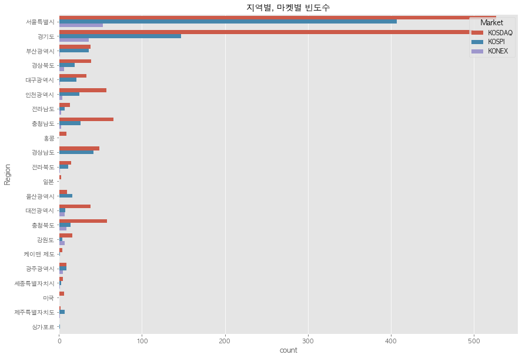


### 연도별 상장 종목 빈도수 분석


```python
# Market, ListingYear 빈도수 구하기
# market_year
Market_Year = pd.crosstab(df["Market"],df["ListingYear"])
Market_Year
```


<div>
<style scoped>
    .dataframe tbody tr th:only-of-type {
        vertical-align: middle;
    }

    .dataframe tbody tr th {
        vertical-align: top;
    }

    .dataframe thead th {
        text-align: right;
    }
</style>
<table border="1" class="dataframe">
  <thead>
    <tr style="text-align: right;">
      <th>ListingYear</th>
      <th>1956.0</th>
      <th>1962.0</th>
      <th>1964.0</th>
      <th>1966.0</th>
      <th>1968.0</th>
      <th>1969.0</th>
      <th>1970.0</th>
      <th>1971.0</th>
      <th>1972.0</th>
      <th>1973.0</th>
      <th>...</th>
      <th>2012.0</th>
      <th>2013.0</th>
      <th>2014.0</th>
      <th>2015.0</th>
      <th>2016.0</th>
      <th>2017.0</th>
      <th>2018.0</th>
      <th>2019.0</th>
      <th>2020.0</th>
      <th>2021.0</th>
    </tr>
    <tr>
      <th>Market</th>
      <th></th>
      <th></th>
      <th></th>
      <th></th>
      <th></th>
      <th></th>
      <th></th>
      <th></th>
      <th></th>
      <th></th>
      <th></th>
      <th></th>
      <th></th>
      <th></th>
      <th></th>
      <th></th>
      <th></th>
      <th></th>
      <th></th>
      <th></th>
      <th></th>
    </tr>
  </thead>
  <tbody>
    <tr>
      <th>KONEX</th>
      <td>0</td>
      <td>0</td>
      <td>0</td>
      <td>0</td>
      <td>0</td>
      <td>0</td>
      <td>0</td>
      <td>0</td>
      <td>0</td>
      <td>0</td>
      <td>...</td>
      <td>0</td>
      <td>12</td>
      <td>13</td>
      <td>27</td>
      <td>26</td>
      <td>19</td>
      <td>14</td>
      <td>15</td>
      <td>12</td>
      <td>0</td>
    </tr>
    <tr>
      <th>KOSDAQ</th>
      <td>0</td>
      <td>0</td>
      <td>0</td>
      <td>0</td>
      <td>0</td>
      <td>0</td>
      <td>0</td>
      <td>0</td>
      <td>0</td>
      <td>0</td>
      <td>...</td>
      <td>20</td>
      <td>35</td>
      <td>59</td>
      <td>90</td>
      <td>65</td>
      <td>68</td>
      <td>89</td>
      <td>97</td>
      <td>86</td>
      <td>33</td>
    </tr>
    <tr>
      <th>KOSPI</th>
      <td>5</td>
      <td>1</td>
      <td>1</td>
      <td>1</td>
      <td>6</td>
      <td>5</td>
      <td>4</td>
      <td>1</td>
      <td>3</td>
      <td>22</td>
      <td>...</td>
      <td>14</td>
      <td>11</td>
      <td>9</td>
      <td>18</td>
      <td>18</td>
      <td>20</td>
      <td>19</td>
      <td>15</td>
      <td>14</td>
      <td>5</td>
    </tr>
  </tbody>
</table>
<p>3 rows × 57 columns</p>
</div>


### Pandas를 통한 시각화 6.2 연속


```python
# Pandas plot 기능 활용하여 기본 그래프(line)를 그림
# Pandas plot으로 그릴 때 x축에 인덱스 값이 y축에는 컬럼에 있는 값이 들어감.
# 컬럼이 여러개라면 다른 색상으로 그려짐.
g = Market_Year.T.plot(figsize = (10,4), title = "연도별 시장별 빈도수")
```


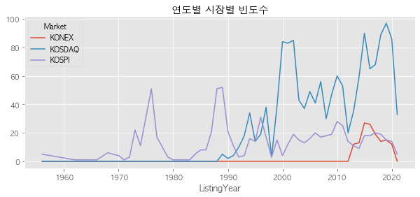


```python
# 컬럼값을 subplots 으로 그립니다.
g = Market_Year.T.plot(figsize = (10,4), title = "연도별 시장별 빈도수", subplots = True)
```


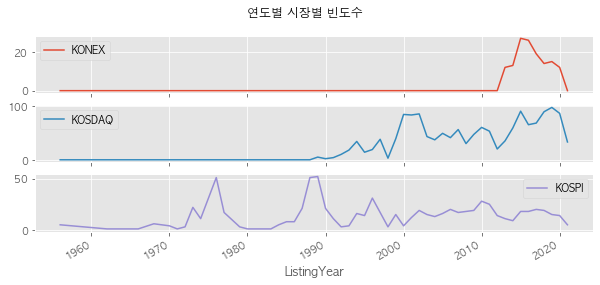


```python
# Pandas plot 기능 활용하여 막대 그래프(bar, barh)를 그립니다.
Market_Year.T.plot.bar(figsize = (10,8), title = "연도별 시장별 빈도수")
```


    <matplotlib.axes._subplots.AxesSubplot at 0x1a2de802d0>


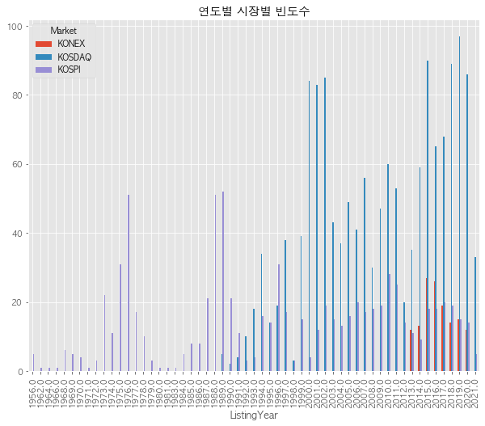


### seaborn을 통한 빈도수 시각화


```python
# Seaborn countplot 활용하여 빈도수를 표현합니다.
# hue 를 사용해 다른 변수를 함께 표현합니다. hue는 색상을 의미합니다.
plt.figure(figsize = (10,14))
sns.countplot(data = df, y = "ListingYear", hue = "Market").set_title("연도별 시장별 빈도수")
```


    Text(0.5, 1.0, '연도별 시장별 빈도수')


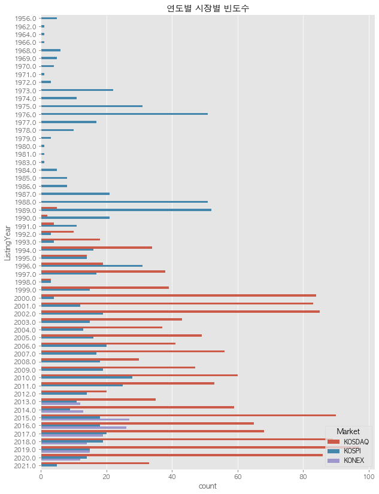


### groupby 와 pivot_table로 빈도수 구하기


```python
# groupby([인덱스 컬럼 리스트])[연산에 사용할 컬럼].연산()
# market_year
#groupby(["Market","ListingYear"])
market_year_groupby = df.groupby(["Market","ListingYear"])["Symbol"].count().unstack().fillna(0).astype(int)
market_year_groupby.columns = market_year_groupby.columns.astype(int)
market_year_groupby
```


<div>
<style scoped>
    .dataframe tbody tr th:only-of-type {
        vertical-align: middle;
    }

    .dataframe tbody tr th {
        vertical-align: top;
    }

    .dataframe thead th {
        text-align: right;
    }
</style>
<table border="1" class="dataframe">
  <thead>
    <tr style="text-align: right;">
      <th></th>
      <th>1956</th>
      <th>1962</th>
      <th>1964</th>
      <th>1966</th>
      <th>1968</th>
      <th>1969</th>
      <th>1970</th>
      <th>1971</th>
      <th>1972</th>
      <th>1973</th>
      <th>...</th>
      <th>2012</th>
      <th>2013</th>
      <th>2014</th>
      <th>2015</th>
      <th>2016</th>
      <th>2017</th>
      <th>2018</th>
      <th>2019</th>
      <th>2020</th>
      <th>2021</th>
    </tr>
    <tr>
      <th>Market</th>
      <th></th>
      <th></th>
      <th></th>
      <th></th>
      <th></th>
      <th></th>
      <th></th>
      <th></th>
      <th></th>
      <th></th>
      <th></th>
      <th></th>
      <th></th>
      <th></th>
      <th></th>
      <th></th>
      <th></th>
      <th></th>
      <th></th>
      <th></th>
      <th></th>
    </tr>
  </thead>
  <tbody>
    <tr>
      <th>KONEX</th>
      <td>0</td>
      <td>0</td>
      <td>0</td>
      <td>0</td>
      <td>0</td>
      <td>0</td>
      <td>0</td>
      <td>0</td>
      <td>0</td>
      <td>0</td>
      <td>...</td>
      <td>0</td>
      <td>12</td>
      <td>13</td>
      <td>27</td>
      <td>26</td>
      <td>19</td>
      <td>14</td>
      <td>15</td>
      <td>12</td>
      <td>0</td>
    </tr>
    <tr>
      <th>KOSDAQ</th>
      <td>0</td>
      <td>0</td>
      <td>0</td>
      <td>0</td>
      <td>0</td>
      <td>0</td>
      <td>0</td>
      <td>0</td>
      <td>0</td>
      <td>0</td>
      <td>...</td>
      <td>20</td>
      <td>35</td>
      <td>59</td>
      <td>90</td>
      <td>65</td>
      <td>68</td>
      <td>89</td>
      <td>97</td>
      <td>86</td>
      <td>33</td>
    </tr>
    <tr>
      <th>KOSPI</th>
      <td>5</td>
      <td>1</td>
      <td>1</td>
      <td>1</td>
      <td>6</td>
      <td>5</td>
      <td>4</td>
      <td>1</td>
      <td>3</td>
      <td>22</td>
      <td>...</td>
      <td>14</td>
      <td>11</td>
      <td>9</td>
      <td>18</td>
      <td>18</td>
      <td>20</td>
      <td>19</td>
      <td>15</td>
      <td>14</td>
      <td>5</td>
    </tr>
  </tbody>
</table>
<p>3 rows × 57 columns</p>
</div>


```python
# pivot_table로 같은 결과가 나오게 연산하기
market_year_pivot = pd.pivot_table(data = df, index = ["Market"], 
               columns = "ListingYear", values = "Symbol", 
               aggfunc = "count", fill_value = 0).astype(int)
market_year_pivot.columns = market_year_pivot.columns.astype(int)
market_year_pivot
```


<div>
<style scoped>
    .dataframe tbody tr th:only-of-type {
        vertical-align: middle;
    }

    .dataframe tbody tr th {
        vertical-align: top;
    }

    .dataframe thead th {
        text-align: right;
    }
</style>
<table border="1" class="dataframe">
  <thead>
    <tr style="text-align: right;">
      <th></th>
      <th>1956</th>
      <th>1962</th>
      <th>1964</th>
      <th>1966</th>
      <th>1968</th>
      <th>1969</th>
      <th>1970</th>
      <th>1971</th>
      <th>1972</th>
      <th>1973</th>
      <th>...</th>
      <th>2012</th>
      <th>2013</th>
      <th>2014</th>
      <th>2015</th>
      <th>2016</th>
      <th>2017</th>
      <th>2018</th>
      <th>2019</th>
      <th>2020</th>
      <th>2021</th>
    </tr>
    <tr>
      <th>Market</th>
      <th></th>
      <th></th>
      <th></th>
      <th></th>
      <th></th>
      <th></th>
      <th></th>
      <th></th>
      <th></th>
      <th></th>
      <th></th>
      <th></th>
      <th></th>
      <th></th>
      <th></th>
      <th></th>
      <th></th>
      <th></th>
      <th></th>
      <th></th>
      <th></th>
    </tr>
  </thead>
  <tbody>
    <tr>
      <th>KONEX</th>
      <td>0</td>
      <td>0</td>
      <td>0</td>
      <td>0</td>
      <td>0</td>
      <td>0</td>
      <td>0</td>
      <td>0</td>
      <td>0</td>
      <td>0</td>
      <td>...</td>
      <td>0</td>
      <td>12</td>
      <td>13</td>
      <td>27</td>
      <td>26</td>
      <td>19</td>
      <td>14</td>
      <td>15</td>
      <td>12</td>
      <td>0</td>
    </tr>
    <tr>
      <th>KOSDAQ</th>
      <td>0</td>
      <td>0</td>
      <td>0</td>
      <td>0</td>
      <td>0</td>
      <td>0</td>
      <td>0</td>
      <td>0</td>
      <td>0</td>
      <td>0</td>
      <td>...</td>
      <td>20</td>
      <td>35</td>
      <td>59</td>
      <td>90</td>
      <td>65</td>
      <td>68</td>
      <td>89</td>
      <td>97</td>
      <td>86</td>
      <td>33</td>
    </tr>
    <tr>
      <th>KOSPI</th>
      <td>5</td>
      <td>1</td>
      <td>1</td>
      <td>1</td>
      <td>6</td>
      <td>5</td>
      <td>4</td>
      <td>1</td>
      <td>3</td>
      <td>22</td>
      <td>...</td>
      <td>14</td>
      <td>11</td>
      <td>9</td>
      <td>18</td>
      <td>18</td>
      <td>20</td>
      <td>19</td>
      <td>15</td>
      <td>14</td>
      <td>5</td>
    </tr>
  </tbody>
</table>
<p>3 rows × 57 columns</p>
</div>


```python
# 위의 groupby 결과를 scatterplot으로 시각화하자.
# df_market_year
df_market_year_sns = df.groupby(["Market","ListingYear"])["Symbol"].count()
df_market_year_sns = df_market_year_sns.reset_index()
df_market_year_sns = df_market_year_sns.rename(columns = {"Symbol":"Count"})
df_market_year_sns.head()
```


<div>
<style scoped>
    .dataframe tbody tr th:only-of-type {
        vertical-align: middle;
    }

    .dataframe tbody tr th {
        vertical-align: top;
    }

    .dataframe thead th {
        text-align: right;
    }
</style>
<table border="1" class="dataframe">
  <thead>
    <tr style="text-align: right;">
      <th></th>
      <th>Market</th>
      <th>ListingYear</th>
      <th>Count</th>
    </tr>
  </thead>
  <tbody>
    <tr>
      <th>0</th>
      <td>KONEX</td>
      <td>2013.0</td>
      <td>12</td>
    </tr>
    <tr>
      <th>1</th>
      <td>KONEX</td>
      <td>2014.0</td>
      <td>13</td>
    </tr>
    <tr>
      <th>2</th>
      <td>KONEX</td>
      <td>2015.0</td>
      <td>27</td>
    </tr>
    <tr>
      <th>3</th>
      <td>KONEX</td>
      <td>2016.0</td>
      <td>26</td>
    </tr>
    <tr>
      <th>4</th>
      <td>KONEX</td>
      <td>2017.0</td>
      <td>19</td>
    </tr>
  </tbody>
</table>
</div>


```python
plt.figure(figsize = (10,4))
sns.scatterplot(data = df_market_year_sns, x = "ListingYear", y = "Count", hue = "Market" )
```


    <matplotlib.axes._subplots.AxesSubplot at 0x1a29300d90>


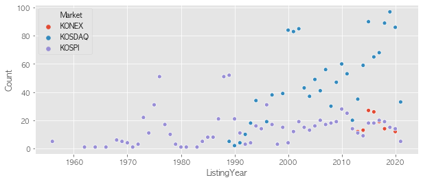


```python
# lineplot 그리기
plt.figure(figsize = (10,4))
sns.lineplot(data = df_market_year_sns, x = "ListingYear", y = "Count", hue = "Market", ci = None  )
```


    <matplotlib.axes._subplots.AxesSubplot at 0x1a29ca6bd0>


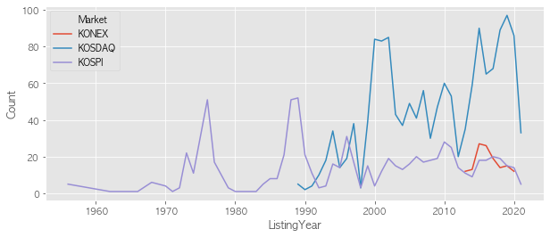


```python
# relplot으로 subplot 그리기 - scatter
sns.relplot(data = df_market_year_sns, x = "ListingYear", y = "Count", hue = "Market", col = "Market")
```


    <seaborn.axisgrid.FacetGrid at 0x1a29a824d0>


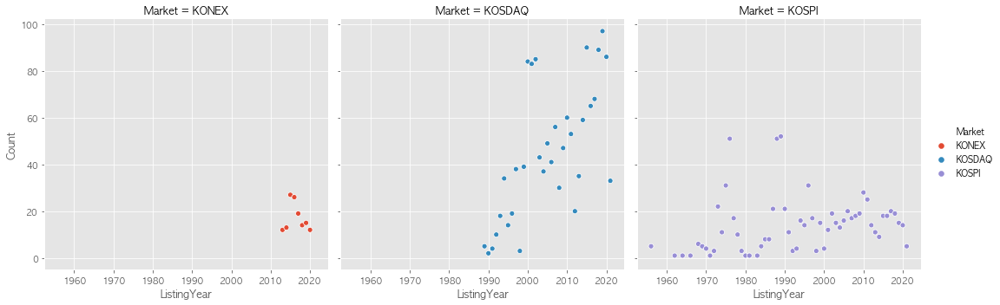


```python
# relplot으로 subplot 그리기 - line
sns.relplot(data = df_market_year_sns, x = "ListingYear", 
            y = "Count", hue = "Market", row = "Market", kind = "line",
            height=2, aspect=3)
```


    <seaborn.axisgrid.FacetGrid at 0x1a2b069ed0>


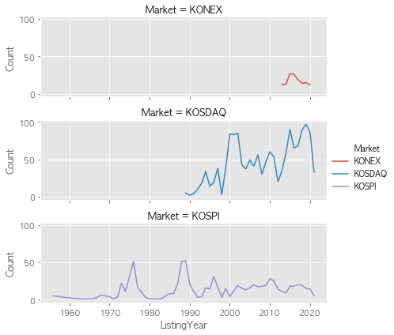


## 데이터 색인후 시각화


```python
# 케이맨 제도에 있는 회사 찾기
df[df["Region"] == "서울특별시"]
```


<div>
<style scoped>
    .dataframe tbody tr th:only-of-type {
        vertical-align: middle;
    }

    .dataframe tbody tr th {
        vertical-align: top;
    }

    .dataframe thead th {
        text-align: right;
    }
</style>
<table border="1" class="dataframe">
  <thead>
    <tr style="text-align: right;">
      <th></th>
      <th>Symbol</th>
      <th>Market</th>
      <th>Name</th>
      <th>Sector</th>
      <th>Industry</th>
      <th>ListingDate</th>
      <th>SettleMonth</th>
      <th>Representative</th>
      <th>HomePage</th>
      <th>Region</th>
      <th>ListingYear</th>
    </tr>
  </thead>
  <tbody>
    <tr>
      <th>0</th>
      <td>060310</td>
      <td>KOSDAQ</td>
      <td>3S</td>
      <td>특수 목적용 기계 제조업</td>
      <td>반도체 웨이퍼 캐리어</td>
      <td>2002-04-23</td>
      <td>03월</td>
      <td>박종익, 김세완 (각자 대표이사)</td>
      <td>http://www.3sref.com</td>
      <td>서울특별시</td>
      <td>2002.0</td>
    </tr>
    <tr>
      <th>1</th>
      <td>095570</td>
      <td>KOSPI</td>
      <td>AJ네트웍스</td>
      <td>산업용 기계 및 장비 임대업</td>
      <td>렌탈(파렛트, OA장비, 건설장비)</td>
      <td>2015-08-21</td>
      <td>12월</td>
      <td>이현우, 박대현</td>
      <td>http://www.ajnet.co.kr</td>
      <td>서울특별시</td>
      <td>2015.0</td>
    </tr>
    <tr>
      <th>2</th>
      <td>006840</td>
      <td>KOSPI</td>
      <td>AK홀딩스</td>
      <td>기타 금융업</td>
      <td>지주사업</td>
      <td>1999-08-11</td>
      <td>12월</td>
      <td>채형석, 이석주(각자 대표이사)</td>
      <td>http://www.aekyunggroup.co.kr</td>
      <td>서울특별시</td>
      <td>1999.0</td>
    </tr>
    <tr>
      <th>5</th>
      <td>211270</td>
      <td>KOSDAQ</td>
      <td>AP위성</td>
      <td>통신 및 방송 장비 제조업</td>
      <td>위성통신 단말기</td>
      <td>2016-03-04</td>
      <td>12월</td>
      <td>류장수</td>
      <td>http://www.apsi.co.kr</td>
      <td>서울특별시</td>
      <td>2016.0</td>
    </tr>
    <tr>
      <th>47</th>
      <td>027410</td>
      <td>KOSPI</td>
      <td>BGF</td>
      <td>기타 금융업</td>
      <td>지주회사</td>
      <td>2014-05-19</td>
      <td>12월</td>
      <td>홍정국</td>
      <td>http://www.bgf.co.kr</td>
      <td>서울특별시</td>
      <td>2014.0</td>
    </tr>
    <tr>
      <th>...</th>
      <td>...</td>
      <td>...</td>
      <td>...</td>
      <td>...</td>
      <td>...</td>
      <td>...</td>
      <td>...</td>
      <td>...</td>
      <td>...</td>
      <td>...</td>
      <td>...</td>
    </tr>
    <tr>
      <th>7200</th>
      <td>069260</td>
      <td>KOSPI</td>
      <td>휴켐스</td>
      <td>기타 화학제품 제조업</td>
      <td>화합물,화학제품 제조</td>
      <td>2002-10-07</td>
      <td>12월</td>
      <td>신진용</td>
      <td>http://www.huchems.com</td>
      <td>서울특별시</td>
      <td>2002.0</td>
    </tr>
    <tr>
      <th>7204</th>
      <td>189980</td>
      <td>KOSDAQ</td>
      <td>흥국에프엔비</td>
      <td>비알코올음료 및 얼음 제조업</td>
      <td>과일음료(에이드베이스, 스무디, 착즙쥬스 등)</td>
      <td>2015-08-07</td>
      <td>12월</td>
      <td>박철범, 오길영</td>
      <td>http://www.hyungkuk.com</td>
      <td>서울특별시</td>
      <td>2015.0</td>
    </tr>
    <tr>
      <th>7205</th>
      <td>000540</td>
      <td>KOSPI</td>
      <td>흥국화재</td>
      <td>보험업</td>
      <td>손해보험</td>
      <td>1974-12-05</td>
      <td>12월</td>
      <td>권중원</td>
      <td>http://www.insurance.co.kr</td>
      <td>서울특별시</td>
      <td>1974.0</td>
    </tr>
    <tr>
      <th>7208</th>
      <td>003280</td>
      <td>KOSPI</td>
      <td>흥아해운</td>
      <td>해상 운송업</td>
      <td>외항화물운송업(케미컬탱커)</td>
      <td>1976-06-29</td>
      <td>12월</td>
      <td>이환구</td>
      <td>http://www.heung-a.com</td>
      <td>서울특별시</td>
      <td>1976.0</td>
    </tr>
    <tr>
      <th>7209</th>
      <td>037440</td>
      <td>KOSDAQ</td>
      <td>희림</td>
      <td>건축기술, 엔지니어링 및 관련 기술 서비스업</td>
      <td>설계 및 감리용역</td>
      <td>2000-02-03</td>
      <td>12월</td>
      <td>정영균, 이목운, 허철호 (각자대표)</td>
      <td>http://www.heerim.com</td>
      <td>서울특별시</td>
      <td>2000.0</td>
    </tr>
  </tbody>
</table>
<p>987 rows × 11 columns</p>
</div>


```python
# 1970년 이전에 상장한 기업을 찾습니다.
df.loc[df["ListingYear"] < 1970, :].head()
```


<div>
<style scoped>
    .dataframe tbody tr th:only-of-type {
        vertical-align: middle;
    }

    .dataframe tbody tr th {
        vertical-align: top;
    }

    .dataframe thead th {
        text-align: right;
    }
</style>
<table border="1" class="dataframe">
  <thead>
    <tr style="text-align: right;">
      <th></th>
      <th>Symbol</th>
      <th>Market</th>
      <th>Name</th>
      <th>Sector</th>
      <th>Industry</th>
      <th>ListingDate</th>
      <th>SettleMonth</th>
      <th>Representative</th>
      <th>HomePage</th>
      <th>Region</th>
      <th>ListingYear</th>
    </tr>
  </thead>
  <tbody>
    <tr>
      <th>56</th>
      <td>000120</td>
      <td>KOSPI</td>
      <td>CJ대한통운</td>
      <td>도로 화물 운송업</td>
      <td>Contract Logistics, 포워딩, 항만하역, 해운, 택배국제특송, SCM...</td>
      <td>1956-07-02</td>
      <td>12월</td>
      <td>강신호</td>
      <td>http://www.cjlogistics.com</td>
      <td>서울특별시</td>
      <td>1956.0</td>
    </tr>
    <tr>
      <th>77</th>
      <td>001530</td>
      <td>KOSPI</td>
      <td>DI동일</td>
      <td>상품 중개업</td>
      <td>면사,화섬사,면포,혼방포,스포츠웨어용 신합섬 제조,도매,수출</td>
      <td>1964-01-04</td>
      <td>12월</td>
      <td>서태원, 손재선</td>
      <td>http://www.dong-il.com</td>
      <td>서울특별시</td>
      <td>1964.0</td>
    </tr>
    <tr>
      <th>1909</th>
      <td>004250</td>
      <td>KOSPI</td>
      <td>NPC</td>
      <td>플라스틱제품 제조업</td>
      <td>산업용기프라스틱제품(플라스틱 파렛트,시트 파렛트) 제조,판매</td>
      <td>1969-09-08</td>
      <td>12월</td>
      <td>최병민</td>
      <td>http://www.npc.co.kr</td>
      <td>경기도</td>
      <td>1969.0</td>
    </tr>
    <tr>
      <th>2202</th>
      <td>000050</td>
      <td>KOSPI</td>
      <td>경방</td>
      <td>종합 소매업</td>
      <td>섬유류(면사,면혼방사,면직물,면혼방직물,화섬사,화섬직물) 제조,도매,수출입</td>
      <td>1956-03-03</td>
      <td>12월</td>
      <td>김준, 김담</td>
      <td>http://www.kyungbang.co.kr</td>
      <td>서울특별시</td>
      <td>1956.0</td>
    </tr>
    <tr>
      <th>2476</th>
      <td>001440</td>
      <td>KOSPI</td>
      <td>대한전선</td>
      <td>절연선 및 케이블 제조업</td>
      <td>전력선,통신케이블,적산계기,스텐레스압연제품,광케이블,초고압선,알루미늄 제조,도매/전기공사</td>
      <td>1968-12-27</td>
      <td>12월</td>
      <td>나형균</td>
      <td>http://www.taihan.com</td>
      <td>경기도</td>
      <td>1968.0</td>
    </tr>
  </tbody>
</table>
</div>


```python
# 2020년 상장한 서울특별시에 소재한 코스피 종목을 찾습니다.
seoul = df["Region"] == "서울특별시"
kospi = df["Market"] == "KOSPI"
year = df["ListingYear"] == 2020
df.loc[seoul&kospi&year,:]
```


<div>
<style scoped>
    .dataframe tbody tr th:only-of-type {
        vertical-align: middle;
    }

    .dataframe tbody tr th {
        vertical-align: top;
    }

    .dataframe thead th {
        text-align: right;
    }
</style>
<table border="1" class="dataframe">
  <thead>
    <tr style="text-align: right;">
      <th></th>
      <th>Symbol</th>
      <th>Market</th>
      <th>Name</th>
      <th>Sector</th>
      <th>Industry</th>
      <th>ListingDate</th>
      <th>SettleMonth</th>
      <th>Representative</th>
      <th>HomePage</th>
      <th>Region</th>
      <th>ListingYear</th>
    </tr>
  </thead>
  <tbody>
    <tr>
      <th>93</th>
      <td>365550</td>
      <td>KOSPI</td>
      <td>ESR켄달스퀘어리츠</td>
      <td>부동산 임대 및 공급업</td>
      <td>부동산투자</td>
      <td>2020-12-23</td>
      <td>05월</td>
      <td>박래익</td>
      <td>http://www.esrks-reit.com</td>
      <td>서울특별시</td>
      <td>2020.0</td>
    </tr>
    <tr>
      <th>3410</th>
      <td>357250</td>
      <td>KOSPI</td>
      <td>미래에셋맵스리츠</td>
      <td>부동산 임대 및 공급업</td>
      <td>부동산 임대업</td>
      <td>2020-08-05</td>
      <td>11월</td>
      <td>김호식</td>
      <td>http://www.maps1reit.miraeasset.com</td>
      <td>서울특별시</td>
      <td>2020.0</td>
    </tr>
    <tr>
      <th>4146</th>
      <td>244920</td>
      <td>KOSPI</td>
      <td>에이플러스에셋</td>
      <td>보험 및 연금관련 서비스업</td>
      <td>보험대리 및 중개업</td>
      <td>2020-11-20</td>
      <td>12월</td>
      <td>곽근호, 서성식, 조규남</td>
      <td>NaN</td>
      <td>서울특별시</td>
      <td>2020.0</td>
    </tr>
    <tr>
      <th>4496</th>
      <td>350520</td>
      <td>KOSPI</td>
      <td>이지스레지던스리츠</td>
      <td>부동산 임대 및 공급업</td>
      <td>부동산투자, 취득, 매매, 임대</td>
      <td>2020-08-05</td>
      <td>06월</td>
      <td>박영희</td>
      <td>http://igisresidencereit.com/</td>
      <td>서울특별시</td>
      <td>2020.0</td>
    </tr>
    <tr>
      <th>4501</th>
      <td>334890</td>
      <td>KOSPI</td>
      <td>이지스밸류리츠</td>
      <td>부동산 임대 및 공급업</td>
      <td>부동산투자, 취득, 매매, 임대</td>
      <td>2020-07-16</td>
      <td>08월</td>
      <td>도병운</td>
      <td>http://www.igisvaluereit.com</td>
      <td>서울특별시</td>
      <td>2020.0</td>
    </tr>
    <tr>
      <th>4609</th>
      <td>348950</td>
      <td>KOSPI</td>
      <td>제이알글로벌리츠</td>
      <td>부동산 임대 및 공급업</td>
      <td>벨기에 파이낸스 타워</td>
      <td>2020-08-07</td>
      <td>06월</td>
      <td>오남수</td>
      <td>http://jrglobalreit.com</td>
      <td>서울특별시</td>
      <td>2020.0</td>
    </tr>
    <tr>
      <th>4741</th>
      <td>344820</td>
      <td>KOSPI</td>
      <td>케이씨씨글라스</td>
      <td>유리 및 유리제품 제조업</td>
      <td>판유리 등</td>
      <td>2020-01-21</td>
      <td>12월</td>
      <td>김내환</td>
      <td>http://www.kccglass.co.kr</td>
      <td>서울특별시</td>
      <td>2020.0</td>
    </tr>
    <tr>
      <th>4773</th>
      <td>357120</td>
      <td>KOSPI</td>
      <td>코람코에너지리츠</td>
      <td>부동산 임대 및 공급업</td>
      <td>부동산 투자 및 관리</td>
      <td>2020-08-31</td>
      <td>11월</td>
      <td>이성균</td>
      <td>http://www.koramcoenergyplus.co.kr</td>
      <td>서울특별시</td>
      <td>2020.0</td>
    </tr>
    <tr>
      <th>4924</th>
      <td>363280</td>
      <td>KOSPI</td>
      <td>티와이홀딩스</td>
      <td>기타 금융업</td>
      <td>지주사업</td>
      <td>2020-09-22</td>
      <td>12월</td>
      <td>유종연</td>
      <td>http://www.ty-holdings.co.kr</td>
      <td>서울특별시</td>
      <td>2020.0</td>
    </tr>
    <tr>
      <th>5079</th>
      <td>352820</td>
      <td>KOSPI</td>
      <td>하이브</td>
      <td>오디오물 출판 및 원판 녹음업</td>
      <td>음악 기획/제작, 퍼블리싱, 아티스트 매니지먼트</td>
      <td>2020-10-15</td>
      <td>12월</td>
      <td>방시혁</td>
      <td>http://www.bighitcorp.com</td>
      <td>서울특별시</td>
      <td>2020.0</td>
    </tr>
  </tbody>
</table>
</div>


### 지역별 섹터


```python
df_sr = pd.crosstab(df["Sector"],df["Region"]) #index가 Sector, Region이 컬럼
df_sr
```


<div>
<style scoped>
    .dataframe tbody tr th:only-of-type {
        vertical-align: middle;
    }

    .dataframe tbody tr th {
        vertical-align: top;
    }

    .dataframe thead th {
        text-align: right;
    }
</style>
<table border="1" class="dataframe">
  <thead>
    <tr style="text-align: right;">
      <th>Region</th>
      <th>강원도</th>
      <th>경기도</th>
      <th>경상남도</th>
      <th>경상북도</th>
      <th>광주광역시</th>
      <th>대구광역시</th>
      <th>대전광역시</th>
      <th>미국</th>
      <th>부산광역시</th>
      <th>서울특별시</th>
      <th>...</th>
      <th>울산광역시</th>
      <th>인천광역시</th>
      <th>일본</th>
      <th>전라남도</th>
      <th>전라북도</th>
      <th>제주특별자치도</th>
      <th>충청남도</th>
      <th>충청북도</th>
      <th>케이맨 제도</th>
      <th>홍콩</th>
    </tr>
    <tr>
      <th>Sector</th>
      <th></th>
      <th></th>
      <th></th>
      <th></th>
      <th></th>
      <th></th>
      <th></th>
      <th></th>
      <th></th>
      <th></th>
      <th></th>
      <th></th>
      <th></th>
      <th></th>
      <th></th>
      <th></th>
      <th></th>
      <th></th>
      <th></th>
      <th></th>
      <th></th>
    </tr>
  </thead>
  <tbody>
    <tr>
      <th>1차 비철금속 제조업</th>
      <td>0</td>
      <td>7</td>
      <td>1</td>
      <td>1</td>
      <td>0</td>
      <td>3</td>
      <td>1</td>
      <td>0</td>
      <td>1</td>
      <td>3</td>
      <td>...</td>
      <td>0</td>
      <td>0</td>
      <td>0</td>
      <td>0</td>
      <td>0</td>
      <td>0</td>
      <td>1</td>
      <td>0</td>
      <td>0</td>
      <td>0</td>
    </tr>
    <tr>
      <th>1차 철강 제조업</th>
      <td>0</td>
      <td>4</td>
      <td>12</td>
      <td>7</td>
      <td>1</td>
      <td>0</td>
      <td>1</td>
      <td>0</td>
      <td>11</td>
      <td>11</td>
      <td>...</td>
      <td>0</td>
      <td>4</td>
      <td>0</td>
      <td>1</td>
      <td>1</td>
      <td>0</td>
      <td>4</td>
      <td>0</td>
      <td>0</td>
      <td>0</td>
    </tr>
    <tr>
      <th>가구 제조업</th>
      <td>0</td>
      <td>4</td>
      <td>0</td>
      <td>0</td>
      <td>0</td>
      <td>0</td>
      <td>0</td>
      <td>0</td>
      <td>0</td>
      <td>3</td>
      <td>...</td>
      <td>0</td>
      <td>1</td>
      <td>0</td>
      <td>0</td>
      <td>0</td>
      <td>0</td>
      <td>0</td>
      <td>0</td>
      <td>0</td>
      <td>0</td>
    </tr>
    <tr>
      <th>가전제품 및 정보통신장비 소매업</th>
      <td>0</td>
      <td>0</td>
      <td>0</td>
      <td>0</td>
      <td>0</td>
      <td>1</td>
      <td>0</td>
      <td>0</td>
      <td>0</td>
      <td>1</td>
      <td>...</td>
      <td>0</td>
      <td>0</td>
      <td>0</td>
      <td>0</td>
      <td>0</td>
      <td>0</td>
      <td>0</td>
      <td>0</td>
      <td>0</td>
      <td>0</td>
    </tr>
    <tr>
      <th>가정용 기기 제조업</th>
      <td>0</td>
      <td>6</td>
      <td>1</td>
      <td>0</td>
      <td>1</td>
      <td>0</td>
      <td>0</td>
      <td>0</td>
      <td>0</td>
      <td>1</td>
      <td>...</td>
      <td>0</td>
      <td>0</td>
      <td>0</td>
      <td>0</td>
      <td>0</td>
      <td>0</td>
      <td>0</td>
      <td>0</td>
      <td>0</td>
      <td>0</td>
    </tr>
    <tr>
      <th>...</th>
      <td>...</td>
      <td>...</td>
      <td>...</td>
      <td>...</td>
      <td>...</td>
      <td>...</td>
      <td>...</td>
      <td>...</td>
      <td>...</td>
      <td>...</td>
      <td>...</td>
      <td>...</td>
      <td>...</td>
      <td>...</td>
      <td>...</td>
      <td>...</td>
      <td>...</td>
      <td>...</td>
      <td>...</td>
      <td>...</td>
      <td>...</td>
    </tr>
    <tr>
      <th>해상 운송업</th>
      <td>0</td>
      <td>0</td>
      <td>0</td>
      <td>0</td>
      <td>0</td>
      <td>0</td>
      <td>0</td>
      <td>0</td>
      <td>0</td>
      <td>5</td>
      <td>...</td>
      <td>0</td>
      <td>0</td>
      <td>0</td>
      <td>0</td>
      <td>0</td>
      <td>0</td>
      <td>0</td>
      <td>0</td>
      <td>0</td>
      <td>0</td>
    </tr>
    <tr>
      <th>해체, 선별 및 원료 재생업</th>
      <td>0</td>
      <td>1</td>
      <td>0</td>
      <td>0</td>
      <td>0</td>
      <td>0</td>
      <td>0</td>
      <td>0</td>
      <td>0</td>
      <td>0</td>
      <td>...</td>
      <td>0</td>
      <td>0</td>
      <td>0</td>
      <td>0</td>
      <td>0</td>
      <td>0</td>
      <td>0</td>
      <td>0</td>
      <td>0</td>
      <td>0</td>
    </tr>
    <tr>
      <th>화학섬유 제조업</th>
      <td>0</td>
      <td>1</td>
      <td>0</td>
      <td>1</td>
      <td>0</td>
      <td>1</td>
      <td>0</td>
      <td>0</td>
      <td>0</td>
      <td>6</td>
      <td>...</td>
      <td>0</td>
      <td>0</td>
      <td>0</td>
      <td>0</td>
      <td>1</td>
      <td>0</td>
      <td>0</td>
      <td>0</td>
      <td>0</td>
      <td>0</td>
    </tr>
    <tr>
      <th>환경 정화 및 복원업</th>
      <td>0</td>
      <td>0</td>
      <td>0</td>
      <td>0</td>
      <td>0</td>
      <td>0</td>
      <td>0</td>
      <td>0</td>
      <td>0</td>
      <td>0</td>
      <td>...</td>
      <td>0</td>
      <td>0</td>
      <td>0</td>
      <td>0</td>
      <td>0</td>
      <td>0</td>
      <td>1</td>
      <td>0</td>
      <td>0</td>
      <td>0</td>
    </tr>
    <tr>
      <th>회사 본부 및 경영 컨설팅 서비스업</th>
      <td>0</td>
      <td>1</td>
      <td>0</td>
      <td>0</td>
      <td>0</td>
      <td>1</td>
      <td>0</td>
      <td>0</td>
      <td>2</td>
      <td>7</td>
      <td>...</td>
      <td>0</td>
      <td>0</td>
      <td>0</td>
      <td>0</td>
      <td>0</td>
      <td>0</td>
      <td>0</td>
      <td>0</td>
      <td>0</td>
      <td>0</td>
    </tr>
  </tbody>
</table>
<p>158 rows × 22 columns</p>
</div>


### 컬럼과 인덱스 값으로 색인하기


```python
# 특정 컬럼만 가져오기
#df_sr[["강원도","대구광역시"]] 아래 코드와 같음. 
df_sr.loc[:,["강원도","대구광역시"]]
```


<div>
<style scoped>
    .dataframe tbody tr th:only-of-type {
        vertical-align: middle;
    }

    .dataframe tbody tr th {
        vertical-align: top;
    }

    .dataframe thead th {
        text-align: right;
    }
</style>
<table border="1" class="dataframe">
  <thead>
    <tr style="text-align: right;">
      <th>Region</th>
      <th>강원도</th>
      <th>대구광역시</th>
    </tr>
    <tr>
      <th>Sector</th>
      <th></th>
      <th></th>
    </tr>
  </thead>
  <tbody>
    <tr>
      <th>1차 비철금속 제조업</th>
      <td>0</td>
      <td>3</td>
    </tr>
    <tr>
      <th>1차 철강 제조업</th>
      <td>0</td>
      <td>0</td>
    </tr>
    <tr>
      <th>가구 제조업</th>
      <td>0</td>
      <td>0</td>
    </tr>
    <tr>
      <th>가전제품 및 정보통신장비 소매업</th>
      <td>0</td>
      <td>1</td>
    </tr>
    <tr>
      <th>가정용 기기 제조업</th>
      <td>0</td>
      <td>0</td>
    </tr>
    <tr>
      <th>...</th>
      <td>...</td>
      <td>...</td>
    </tr>
    <tr>
      <th>해상 운송업</th>
      <td>0</td>
      <td>0</td>
    </tr>
    <tr>
      <th>해체, 선별 및 원료 재생업</th>
      <td>0</td>
      <td>0</td>
    </tr>
    <tr>
      <th>화학섬유 제조업</th>
      <td>0</td>
      <td>1</td>
    </tr>
    <tr>
      <th>환경 정화 및 복원업</th>
      <td>0</td>
      <td>0</td>
    </tr>
    <tr>
      <th>회사 본부 및 경영 컨설팅 서비스업</th>
      <td>0</td>
      <td>1</td>
    </tr>
  </tbody>
</table>
<p>158 rows × 2 columns</p>
</div>


### 특정 행만 가져오기


```python
df_sr.loc["소프트웨어 개발 및 공급업", :]
```


    Region
    강원도         0
    경기도        37
    경상남도        0
    경상북도        0
    광주광역시       0
    대구광역시       0
    대전광역시       1
    미국          0
    부산광역시       1
    서울특별시      97
    세종특별자치시     0
    싱가포르        0
    울산광역시       0
    인천광역시       0
    일본          2
    전라남도        0
    전라북도        0
    제주특별자치도     0
    충청남도        0
    충청북도        2
    케이맨 제도      0
    홍콩          1
    Name: 소프트웨어 개발 및 공급업, dtype: int64


```python
df_sr.loc[["소프트웨어 개발 및 공급업","금융 지원 서비스업","의약품 제조업"], :]
```


<div>
<style scoped>
    .dataframe tbody tr th:only-of-type {
        vertical-align: middle;
    }

    .dataframe tbody tr th {
        vertical-align: top;
    }

    .dataframe thead th {
        text-align: right;
    }
</style>
<table border="1" class="dataframe">
  <thead>
    <tr style="text-align: right;">
      <th>Region</th>
      <th>강원도</th>
      <th>경기도</th>
      <th>경상남도</th>
      <th>경상북도</th>
      <th>광주광역시</th>
      <th>대구광역시</th>
      <th>대전광역시</th>
      <th>미국</th>
      <th>부산광역시</th>
      <th>서울특별시</th>
      <th>...</th>
      <th>울산광역시</th>
      <th>인천광역시</th>
      <th>일본</th>
      <th>전라남도</th>
      <th>전라북도</th>
      <th>제주특별자치도</th>
      <th>충청남도</th>
      <th>충청북도</th>
      <th>케이맨 제도</th>
      <th>홍콩</th>
    </tr>
    <tr>
      <th>Sector</th>
      <th></th>
      <th></th>
      <th></th>
      <th></th>
      <th></th>
      <th></th>
      <th></th>
      <th></th>
      <th></th>
      <th></th>
      <th></th>
      <th></th>
      <th></th>
      <th></th>
      <th></th>
      <th></th>
      <th></th>
      <th></th>
      <th></th>
      <th></th>
      <th></th>
    </tr>
  </thead>
  <tbody>
    <tr>
      <th>소프트웨어 개발 및 공급업</th>
      <td>0</td>
      <td>37</td>
      <td>0</td>
      <td>0</td>
      <td>0</td>
      <td>0</td>
      <td>1</td>
      <td>0</td>
      <td>1</td>
      <td>97</td>
      <td>...</td>
      <td>0</td>
      <td>0</td>
      <td>2</td>
      <td>0</td>
      <td>0</td>
      <td>0</td>
      <td>0</td>
      <td>2</td>
      <td>0</td>
      <td>1</td>
    </tr>
    <tr>
      <th>금융 지원 서비스업</th>
      <td>0</td>
      <td>0</td>
      <td>0</td>
      <td>0</td>
      <td>0</td>
      <td>0</td>
      <td>0</td>
      <td>0</td>
      <td>0</td>
      <td>75</td>
      <td>...</td>
      <td>0</td>
      <td>0</td>
      <td>0</td>
      <td>0</td>
      <td>0</td>
      <td>0</td>
      <td>0</td>
      <td>0</td>
      <td>0</td>
      <td>0</td>
    </tr>
    <tr>
      <th>의약품 제조업</th>
      <td>5</td>
      <td>34</td>
      <td>1</td>
      <td>0</td>
      <td>0</td>
      <td>0</td>
      <td>2</td>
      <td>0</td>
      <td>1</td>
      <td>39</td>
      <td>...</td>
      <td>0</td>
      <td>2</td>
      <td>0</td>
      <td>0</td>
      <td>0</td>
      <td>0</td>
      <td>2</td>
      <td>6</td>
      <td>0</td>
      <td>0</td>
    </tr>
  </tbody>
</table>
<p>3 rows × 22 columns</p>
</div>


```python
df_sr.loc[["소프트웨어 개발 및 공급업","금융 지원 서비스업","의약품 제조업"], ["서울특별시"]]
```


<div>
<style scoped>
    .dataframe tbody tr th:only-of-type {
        vertical-align: middle;
    }

    .dataframe tbody tr th {
        vertical-align: top;
    }

    .dataframe thead th {
        text-align: right;
    }
</style>
<table border="1" class="dataframe">
  <thead>
    <tr style="text-align: right;">
      <th>Region</th>
      <th>서울특별시</th>
    </tr>
    <tr>
      <th>Sector</th>
      <th></th>
    </tr>
  </thead>
  <tbody>
    <tr>
      <th>소프트웨어 개발 및 공급업</th>
      <td>97</td>
    </tr>
    <tr>
      <th>금융 지원 서비스업</th>
      <td>75</td>
    </tr>
    <tr>
      <th>의약품 제조업</th>
      <td>39</td>
    </tr>
  </tbody>
</table>
</div>


```python
# "소프트웨어 개발 및 공급업" 만 가져와서 막대그래프를 그립니다.
g = df_sr.loc["소프트웨어 개발 및 공급업",:].sort_values().plot.barh(figsize=(10,5), title = "지역별 소프트웨어 개발 공급업체 갯수")
```


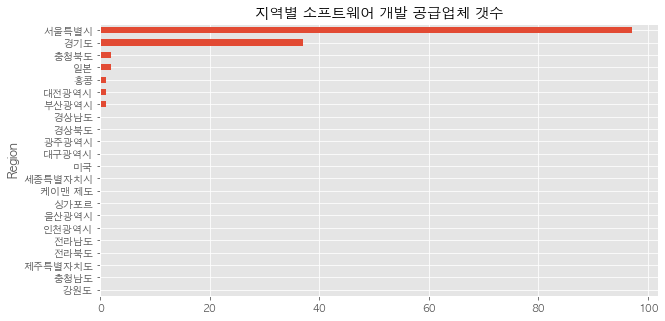


```python
# "의약품 제조업" 만 가져와서 막대그래프를 그립니다.
g = df_sr.loc["의약품 제조업", :].sort_values().plot.barh(figsize=(10,5), title = "지역별 의약품 제조업체 갯수")
```


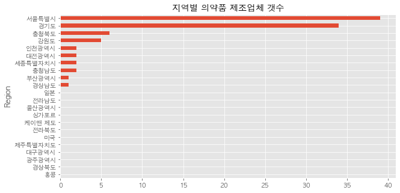

